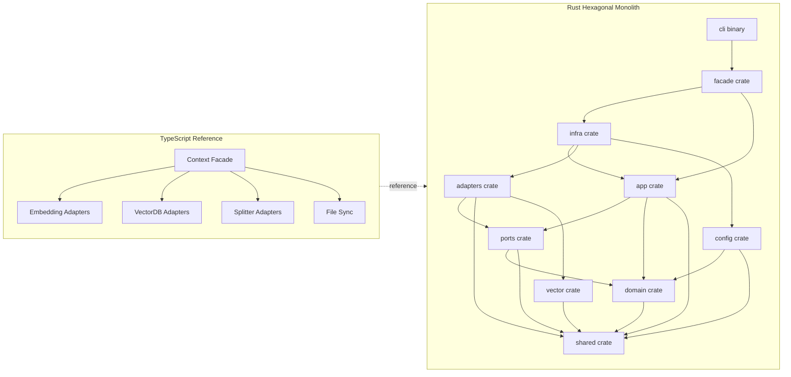

# Rust Semantic Code Search Engine - CLI-first Migration Plan (New Repo)

## Context and current state (where we are)

- **Reference implementation**: TypeScript codebase in `packages/backend/src/` with hexagonal architecture (domain/ports/adapters/app/infra/config/shared/api layers).
- **Reference snapshot**: cloned into `references/` as a read-only upstream snapshot for parity fixtures.
- **Capabilities to port**:
  - Codebase scanning with ignore patterns + extension allow-list
  - AST-aware chunking via Tree-sitter with fallback splitting
  - Embedding providers (OpenAI, Gemini, Voyage, Ollama)
  - Vector search via Milvus gRPC/REST (dense + hybrid)
  - Merkle-based change detection
  - Bounded concurrency with backpressure
  - Structured observability (logger + telemetry)
- **CLI-first target**: deliver a local CLI for indexing and search before any server surface.

## Target architecture (where we want to be)

- **Pattern**: Rust modular monolith with hexagonal boundaries, crate-level layering, and explicit composition root.
- **Primary Rust profile**: CLI-oriented core rules with async add-ons:
  - pack: `pack_rust_cli_tui_shell`
  - modules: `00_rust_core_guardrails`, `30_error_handling`, `70_testing_bench_fuzz`
  - add-on: `40_async_concurrency_and_services` (async IO + cancellation)
- **Decisions locked**:
  - Tree-sitter is the default AST splitter backend.
  - Local vector index is implemented with `hnsw_rs` (no fork to start).
  - ONNX embeddings via `ort` are feature-gated and added in Phase 06.

### Target repository structure

```
semantic-code-agents-rs/
├── Cargo.toml
├── rustfmt.toml
├── clippy.toml
├── deny.toml
├── justfile
├── .github/workflows/
├── references/
│   └── semantic-code-for-agents/
├── crates/
│   ├── core/
│   ├── shared/
│   ├── domain/
│   ├── ports/
│   ├── config/
│   ├── api/
│   ├── vector/
│   ├── adapters/
│   ├── app/
│   ├── infra/
│   ├── facade/
│   └── testkit/
├── bins/
│   └── cli/
└── tests/
    ├── integration/
    └── e2e/
```

### Architecture diagram (hexagonal layers)



### Dependency flow (Cargo.toml)

| Crate | Dependencies |
|-------|--------------|
| `core` | External crates only (no workspace deps) |
| `domain` | `shared` only |
| `shared` | External crates only (no workspace deps) |
| `ports` | `domain`, `shared` |
| `vector` | `shared` |
| `adapters` | `ports`, `shared`, `vector` (local vectordb adapter only) |
| `app` | `ports`, `domain`, `shared` |
| `config` | `domain`, `shared` |
| `infra` | `app`, `adapters`, `config`, `shared` |
| `api` | `domain`, `shared` |
| `facade` | `infra`, `api`, `app` |
| `bins/cli` | `facade`, `core` |

### Guardrails and clarifications (folded into the plan)

- **Adapter independence**: no adapter-to-adapter dependencies or shared mutable state in `infra`; cross-cutting state lives in `shared` or `app`.
- **Async traits**: allow `async_trait` for I/O-bound adapters; avoid boxed futures in hot paths by using batch APIs or explicit futures where needed.
- **Error policy**: no panics; no blanket `Unknown` variants in domain errors; classify errors as retriable vs non-retriable and sanitize at boundaries.
- **Validation ownership**: domain constructors enforce invariants; API/config validation handles shape + bounds only (no duplicated business rules).
- **Cancellation scope**: cancellation is a boundary concern; internal helpers use a `RequestContext` instead of threading tokens everywhere.
- **Observability**: domain stays pure; logging/telemetry live in app/adapters with tracing spans at boundaries.
- **Filter expressions**: explicit allowlist grammar; deny unknown expressions but document that this is not a security boundary.
- **Testing**: mocks live beside port traits; contract tests keep mocks and real adapters aligned.
- **Dependency policy**: standardize HTTP/gRPC stacks and document it to avoid transitive conflicts.
- **Composition root**: prefer lazy initialization for expensive adapters (pools, models).
- **String/embedding storage**: use `Box<str>` for ID primitives; use `Arc<str>` for shared metadata and `Embedding(Arc<[f32]>)` when embedding/vector layers land.
- **Boundary coercion**: parse/normalize numeric strings to typed ints/floats in config/API validation; domain uses strict types only.

---

## Roadmap execution policy

- **Milestones are sequential**: finish all milestone exit gates before starting the next milestone.
- For each milestone: **Analyze -> Build -> Unit Test -> Integrate -> Iterate**.
- **Incremental releases**: cut internal alpha releases at the end of Phase 05 and Phase 06 to reduce big-bang risk.
- **Definition of Done** per milestone:
  - `cargo fmt --check` passes
  - `cargo clippy -- -D warnings` passes
  - Unit tests pass
  - One integration test passes
  - Errors are typed, cancellation is propagated, tests are deterministic

---

## Phase Plans (Exit Gates)

Each phase is a self-contained plan with 4 milestones and 15 sequential todos per milestone.

---

## Phase 01 - Foundations and CLI Stub (Exit gates: 60 TODOs)

### Milestone 1: `feat/p1m1-repo-setup` (Repository and Workspace Setup)

**Primary files**: `Cargo.toml`, `rustfmt.toml`, `clippy.toml`, `deny.toml`

- [x] P01.M1.01 Create new repo with workspace `Cargo.toml` and empty `members` list
- [x] P01.M1.02 Initialize git with `.gitignore` entries for `target/` and `references/`
- [x] P01.M1.03 Add `references/README.md` describing snapshot usage and no-write policy
- [x] P01.M1.04 Add `scripts/refresh-references.sh` to (re)clone the upstream snapshot
- [x] P01.M1.05 Create `rustfmt.toml` with edition 2024 and max width policy
- [x] P01.M1.06 Create `clippy.toml` with `-D warnings` and unwrap/expect deny
- [x] P01.M1.07 Create `deny.toml` for dependency auditing
- [x] P01.M1.08 Create `.cargo/config.toml` with build settings and rustflags
- [x] P01.M1.09 Create `crates/core` with `lib.rs` and `build_info()` stub
- [x] P01.M1.10 Create `crates/shared` skeleton
- [x] P01.M1.11 Create `crates/domain` skeleton
- [x] P01.M1.12 Add workspace lint config in `Cargo.toml`
- [x] P01.M1.13 **Unit test**: `build_info()` returns non-empty fields
- [x] P01.M1.14 **Unit test**: `build_info()` is deterministic across calls
- [x] P01.M1.15 **Integration test**: `cargo test -p semantic-code-core` succeeds

### Milestone 2: `feat/p1m2-hex-skeleton` (Hexagonal Crate Skeleton)

**Primary files**: `docs/architecture.md`, `crates/*/Cargo.toml`

- [x] P01.M2.01 Add crate skeletons: `ports`, `config`, `api`, `vector`, `adapters`, `app`, `infra`, `facade`, `testkit`
- [x] P01.M2.02 Add `bins/cli` skeleton with `Cargo.toml`
- [x] P01.M2.03 Wire workspace members to include all crates and `bins/cli`
- [x] P01.M2.04 Document dependency rules in `docs/architecture.md`
- [x] P01.M2.05 Add `README.md` with CLI-first goals and repo layout
- [x] P01.M2.06 Add `CONTRIBUTING.md` with dev commands
- [x] P01.M2.07 Add `CODEOWNERS` or ownership note
- [x] P01.M2.08 Add crate-level deny unwrap/expect guards to core crates
- [x] P01.M2.09 Add `crates/testkit` placeholder for in-memory adapters
- [x] P01.M2.10 Add `crates/api` v1 module placeholder
- [x] P01.M2.11 **Unit test**: `ports` depends only on `domain` + `shared`
- [x] P01.M2.12 **Unit test**: `adapters` compile without importing `app` or `infra`
- [x] P01.M2.13 **Unit test**: `infra` compiles with `app` + `adapters` + `config`
- [x] P01.M2.14 **Integration test**: workspace builds with `cargo test --workspace`
- [x] P01.M2.15 Record milestone notes in this plan

**Milestone Notes (P01.M2)**:
- Added crate and CLI skeletons with placeholder modules and dependency checks.
- Documented dependency rules in `docs/architecture.md` and updated repo docs.

### Milestone 3: `feat/p1m3-tooling-ci` (CI and Developer Experience)

**Primary files**: `.github/workflows/ci.yml`, `justfile`, `docs/quality-gates.md`

- [x] P01.M3.01 Add `.github/workflows/ci.yml` with fmt/clippy/test jobs
- [x] P01.M3.02 Add `cargo deny` job for dependency checks
- [x] P01.M3.03 Add CI caching for Cargo registry and `target/`
- [x] P01.M3.04 Add `justfile` targets: `check`, `fmt`, `clippy`, `test`, `deny`
- [x] P01.M3.05 Add `scripts/verify.sh` to run fmt/clippy/test locally
- [x] P01.M3.06 Add `docs/quality-gates.md` describing CI requirements
- [x] P01.M3.07 Add `docs/references.md` describing snapshot update flow
- [x] P01.M3.08 Add pre-commit hook to run `just check`
- [x] P01.M3.09 Configure Dependabot and document dependency policy (preferred HTTP/gRPC stacks)
- [x] P01.M3.10 Add a tiny shared unit test to validate the harness
- [x] P01.M3.11 **Unit test**: workspace test harness executes at least one test
- [x] P01.M3.12 **Unit test**: CI workflow YAML validates
- [x] P01.M3.13 **Integration test**: CI runs `cargo test --workspace`
- [x] P01.M3.14 Add ADR template and initial ADR index (async traits, error classes, adapter independence)
- [x] P01.M3.15 Record milestone exit checklist in `docs/quality-gates.md`

### Milestone 4: `feat/p1m4-cli-stub` (Minimal CLI Stub)

**Primary files**: `bins/cli/src/main.rs`, `docs/cli.md`

- [x] P01.M4.01 Add CLI binary with `clap` and `--version` flag
- [x] P01.M4.02 Add `self-check` subcommand calling `core::build_info()`
- [x] P01.M4.03 Add `--json` flag for machine-readable output
- [x] P01.M4.04 Add CLI error module mapping errors to exit codes
- [x] P01.M4.05 Route results to stdout and logs to stderr
- [x] P01.M4.06 Add basic logging stub for CLI
- [x] P01.M4.07 **Unit test**: argument parsing for `--version`
- [x] P01.M4.08 **Unit test**: `self-check` JSON output shape
- [x] P01.M4.09 **Unit test**: exit codes for error paths
- [x] P01.M4.10 **Integration test**: `cargo run --bin sca -- self-check`
- [x] P01.M4.11 **Integration test**: `cargo run --bin sca -- --version`
- [x] P01.M4.12 Add `docs/cli.md` with usage examples
- [x] P01.M4.13 Add `scripts/cli-smoke.sh` for local E2E
- [x] P01.M4.14 Add Phase 01 E2E test entry point
- [x] P01.M4.15 Record Phase 01 exit checklist

### Phase 01 E2E Test

**Location**: `tests/e2e/phase1_cli_smoke.rs`

**Scenario**: Run `cli self-check` and validate deterministic output.

**Phase 01 Exit Checklist**:
- [x] CI/tooling gates in place (fmt/clippy/test/deny + pre-commit)
- [x] CLI stub with `self-check` + JSON output
- [x] Unit + integration + E2E tests added
- [x] CLI usage docs and smoke script in place

---

## Phase 02 - Domain and Shared Types (Exit gates: 60 TODOs)

### Milestone 1: `feat/p2m1-result-errors` (Result and Error Envelope)

**Primary files**: `crates/shared/src/result.rs`, `crates/shared/src/errors.rs`

- [x] P02.M1.01 Implement `shared::result` (Ok/Err + helpers)
- [x] P02.M1.02 Add `ResultExt` helpers (map/map_err/and_then)
- [x] P02.M1.03 Implement `ErrorEnvelope` with expected/invariant/unexpected constructors and retry classification
- [x] P02.M1.04 Define `ErrorCode`, `ErrorKind`, and `ErrorClass` (retriable vs non-retriable)
- [x] P02.M1.05 Add abort error helpers and cancellation check utility
- [x] P02.M1.06 Add `normalize_unexpected_error` helper (classify retriable vs non; no blanket Unknown)
- [x] P02.M1.07 Add redaction helper for error metadata
- [x] P02.M1.08 **Unit test**: Result helpers
- [x] P02.M1.09 **Unit test**: ErrorEnvelope constructors
- [x] P02.M1.10 **Unit test**: normalize_unexpected_error with Error and string
- [x] P02.M1.11 **Unit test**: abort detection
- [x] P02.M1.12 **Integration test**: error propagation across crates
- [x] P02.M1.13 Add `docs/error-policy.md` (classification, boundary sanitization, no domain Unknown)
- [x] P02.M1.14 Add testkit fixtures for common error codes
- [x] P02.M1.15 Record milestone signoff in `docs/phase-02-m1.md`

### Milestone 2: `feat/p2m2-primitives-spans` (Primitives, Spans, Language)

**Primary files**: `crates/domain/src/primitives.rs`, `crates/domain/src/spans.rs`

- [x] P02.M2.01 Implement `CodebaseId`, `CollectionName`, `DocumentId`, `ChunkId` newtypes
- [x] P02.M2.02 Implement `EmbeddingProviderId` and `VectorDbProviderId` newtypes
- [x] P02.M2.03 Add parse/validate constructors returning `Result`
- [x] P02.M2.04 Implement `LineSpan` with validation (start <= end, 1-indexed)
- [x] P02.M2.05 Implement `Language` enum with extension mapping
- [x] P02.M2.06 Implement `derive_collection_name` (deterministic hashing)
- [x] P02.M2.07 Add serde derives for primitives and spans
- [x] P02.M2.08 Add `PrimitiveError` enum for validation failures
- [x] P02.M2.09 **Unit test**: primitives valid/invalid inputs
- [x] P02.M2.10 **Unit test**: LineSpan validation and ordering
- [x] P02.M2.11 **Unit test**: Language mapping for extensions
- [x] P02.M2.12 **Unit test**: derive_collection_name determinism
- [x] P02.M2.13 Add proptest strategies for primitives and spans
- [x] P02.M2.14 **Integration test**: primitives and spans across crates
- [x] P02.M2.15 Record milestone signoff in `docs/phase-02-m2.md`

### Milestone 3: `feat/p2m3-metadata-search-states` (Metadata, Search, State)

**Primary files**: `crates/domain/src/metadata.rs`, `crates/domain/src/search.rs`, `crates/domain/src/states.rs`

- [x] P02.M3.01 Implement `DocumentMetadata` and `ChunkMetadata`
- [x] P02.M3.02 Implement `VectorDocumentMetadata` for external exposure
- [x] P02.M3.03 Implement `SearchQuery`, `SearchFilter`, `SearchOptions`
- [x] P02.M3.04 Implement `SearchResultKey` and `SearchResult` with deterministic ordering
- [x] P02.M3.05 Implement `IndexMode` enum (Dense/Hybrid)
- [x] P02.M3.06 Implement `IndexingState`, `IndexStatus`, `ProgressEvent`
- [x] P02.M3.07 Add `serde(rename_all = "camelCase")` for JSON compatibility
- [x] P02.M3.08 Add validation for metadata fields (non-empty paths, valid spans)
- [x] P02.M3.09 **Unit test**: metadata builder + validation
- [x] P02.M3.10 **Unit test**: SearchResult ordering
- [x] P02.M3.11 **Unit test**: ProgressEvent percentage logic
- [x] P02.M3.12 **Unit test**: serialization matches expected JSON shape
- [x] P02.M3.13 Add proptest for metadata invariants
- [x] P02.M3.14 **Integration test**: metadata, search, and state types compose
- [x] P02.M3.15 Record milestone signoff in `docs/phase-02-m3.md`

### Milestone 4: `feat/p2m4-api-v1-parity` (API v1 and Parity Harness)

**Primary files**: `crates/api/src/v1/*.rs`, `crates/testkit/src/parity.rs`

- [x] P02.M4.01 Implement API v1 DTO structs with serde
- [x] P02.M4.02 Implement ApiV1Result and error DTO mapping from ErrorEnvelope
- [x] P02.M4.03 Add DTO validation helpers (shape/limits only; domain handles invariants)
- [x] P02.M4.04 Add redaction for ApiV1ErrorDto metadata
- [x] P02.M4.05 Add parity harness reading fixtures from `references/`
- [x] P02.M4.06 Add fixture comparisons for API v1 JSON
- [x] P02.M4.07 **Unit test**: DTO JSON roundtrip
- [x] P02.M4.08 **Unit test**: error mapping and redaction
- [x] P02.M4.09 **Unit test**: parity harness missing fixture errors
- [x] P02.M4.10 **Unit test**: ID/collection parity checks
- [x] P02.M4.11 **Integration test**: API v1 mapping to JSON
- [x] P02.M4.12 Add `docs/api-v1.md` (evolution policy + error redaction rules)
- [x] P02.M4.13 Add `scripts/refresh-fixtures.sh`
- [x] P02.M4.14 Add CI job to run parity tests
- [x] P02.M4.15 Record milestone signoff in `docs/phase-02-m4.md`

### Phase 02 E2E Test

**Location**: `tests/e2e/phase2_domain.rs`

**Scenario**: Build metadata -> derive IDs -> create search results -> sort deterministically.

- [x] P02.E2E.01 Implement domain E2E scenario in `tests/e2e/phase2_domain.rs`

---

## Phase 03 - Config and Validation (Exit gates: 60 TODOs)

### Milestone 1: `feat/p3m1-config-schema` (Config Schema)

**Primary files**: `crates/config/src/schema.rs`

- [x] P03.M1.01 Decide validation approach (serde + manual checks)
- [x] P03.M1.02 Define `BackendConfig` structs (core, embedding, vectordb, sync)
- [x] P03.M1.03 Add defaults and bounds for timeouts, limits, batching
- [x] P03.M1.04 Implement validation errors mapped to ErrorEnvelope
- [x] P03.M1.05 Implement normalization for extensions and ignore patterns
- [x] P03.M1.06 Add config version field
- [x] P03.M1.07 **Unit test**: defaults applied correctly
- [x] P03.M1.08 **Unit test**: invalid values return error codes
- [x] P03.M1.09 **Unit test**: normalization ordering is deterministic
- [x] P03.M1.10 **Unit test**: max list sizes enforced
- [x] P03.M1.11 **Integration test**: parse config fixtures
- [x] P03.M1.12 Add `docs/config-schema.md`
- [x] P03.M1.13 Add config fixtures to `testkit`
- [x] P03.M1.14 Add `scripts/validate-config.sh`
- [x] P03.M1.15 Record milestone signoff in `docs/phase-03-m1.md`

### Milestone 2: `feat/p3m2-env-loader` (Env Parsing)

**Primary files**: `crates/config/src/env.rs`

- [x] P03.M2.01 Implement env parsing helpers (trim, csv, bool, int, url)
- [x] P03.M2.02 Define `BackendEnv` mapping from env var names
- [x] P03.M2.03 Implement env-to-config merge precedence
- [x] P03.M2.04 Redact secrets in validation errors
- [x] P03.M2.05 **Unit test**: bool/int parsing with defaults
- [x] P03.M2.06 **Unit test**: CSV parsing normalization
- [x] P03.M2.07 **Unit test**: URL validation and optional fields
- [x] P03.M2.08 **Unit test**: secret redaction behavior
- [x] P03.M2.09 **Integration test**: env map to config
- [x] P03.M2.10 Add `docs/env.md`
- [x] P03.M2.11 Add env fixtures to `testkit`
- [x] P03.M2.12 Add `scripts/print-effective-config.sh`
- [x] P03.M2.13 Add CI check for deterministic parsing
- [x] P03.M2.14 Update CLI self-check to validate env parsing
- [x] P03.M2.15 Record milestone signoff in `docs/phase-03-m2.md`

### Milestone 3: `feat/p3m3-request-validation` (Request DTO Validation)

**Primary files**: `crates/config/src/requests.rs`

- [x] P03.M3.01 Define request DTOs for index/search/reindex/clear
- [x] P03.M3.02 Implement codebase_root path validation rules
- [x] P03.M3.03 Enforce filterExpr allowlist grammar (deny unknown; not a security boundary)
- [x] P03.M3.04 Validate topK and threshold bounds
- [x] P03.M3.05 Add normalization for optional fields (delegate invariants to domain newtypes)
- [x] P03.M3.06 **Unit test**: valid request cases
- [x] P03.M3.07 **Unit test**: invalid request cases
- [x] P03.M3.08 **Unit test**: filterExpr rejection
- [x] P03.M3.09 **Unit test**: path normalization errors
- [x] P03.M3.10 **Integration test**: validate fixtures
- [x] P03.M3.11 Add `docs/request-validation.md` (validation ownership matrix + filterExpr allowlist grammar)
- [x] P03.M3.12 Add request fixtures to `testkit`
- [x] P03.M3.13 Add hidden CLI `validate-request` command
- [x] P03.M3.14 Add CI step for request validation suite
- [x] P03.M3.15 Record milestone signoff in `docs/phase-03-m3.md`

### Milestone 4: `feat/p3m4-config-load` (Config Load + CLI)

**Primary files**: `crates/config/src/load.rs`, `bins/cli`

- [x] P03.M4.01 Implement `config::load()` merging env, file, overrides
- [x] P03.M4.02 Implement deterministic merge order
- [x] P03.M4.03 Add error formatting for user-facing output
- [x] P03.M4.04 Wire CLI `config check`
- [x] P03.M4.05 **Unit test**: override precedence rules
- [x] P03.M4.06 **Unit test**: error formatting redaction
- [x] P03.M4.07 **Unit test**: deterministic config serialization
- [x] P03.M4.08 **Unit test**: config load failure exit code
- [x] P03.M4.09 **Integration test**: CLI config check on fixtures
- [x] P03.M4.10 **Integration test**: CLI config check with env overrides
- [x] P03.M4.11 Add Phase 03 E2E test (config load + request validation)
- [x] P03.M4.12 Add `docs/config-load.md`
- [x] P03.M4.13 Add `scripts/config-e2e.sh`
- [x] P03.M4.14 Add Phase 03 exit checklist
- [x] P03.M4.15 Record Phase 03 signoff

### Phase 03 E2E Test

**Location**: `tests/e2e/phase3_config.rs`

**Scenario**: Load config, validate requests, and emit structured errors.

---

## Phase 04 - Ports and Use-cases (Exit gates: 60 TODOs)

### Milestone 1: `feat/p4m1-ports-testkit` (Port Traits and Concurrency)

**Primary files**: `crates/ports/src/lib.rs`, `crates/shared/src/concurrency.rs`

- [x] P04.M1.01 Decide async runtime (`tokio`) and async-trait strategy (boxed vs generic/batch)
- [x] P04.M1.02 Define port traits for embedding, vectordb, splitter, filesystem, ignore, sync (include naming conventions)
- [x] P04.M1.03 Define logger and telemetry ports (kept out of domain)
- [x] P04.M1.04 Define shared DTOs (VectorDocument, HybridSearchRequest)
- [x] P04.M1.05 Implement `RequestContext` (cancellation + correlation id) and cancellation helpers
- [x] P04.M1.06 Implement bounded queue and worker pool with explicit backpressure policy
- [x] P04.M1.07 Implement in-memory adapters in `testkit` with a contract-test harness
- [x] P04.M1.08 **Unit test**: bounded queue backpressure
- [x] P04.M1.09 **Unit test**: worker pool ordering + cancellation
- [x] P04.M1.10 **Unit test**: in-memory embedding/vectordb adapters
- [x] P04.M1.11 **Unit test**: noop logger and telemetry
- [x] P04.M1.12 **Integration test**: contract tests exercised via in-memory adapters
- [x] P04.M1.13 Add `docs/ports.md` (naming, async-trait guidance, error classes, RequestContext)
- [x] P04.M1.14 Add `docs/concurrency.md` (backpressure + batching strategy)
- [x] P04.M1.15 Record milestone signoff in `docs/phase-04-m1.md`

### Milestone 2: `feat/p4m2-index-usecase` (Index Codebase Use-case)

**Primary files**: `crates/app/src/index_codebase.rs`

- [x] P04.M2.01 Implement `index_codebase` use-case
- [x] P04.M2.02 Add deterministic traversal and extension filtering
- [x] P04.M2.03 Apply ignore matching during scan
- [x] P04.M2.04 Wire chunking pipeline (split -> embed -> insert) with explicit batching/backpressure
- [x] P04.M2.05 Enforce chunk limit and buffered caps
- [x] P04.M2.06 Add progress callbacks and telemetry counters
- [x] P04.M2.07 **Unit test**: extension filtering and ordering
- [x] P04.M2.08 **Unit test**: chunk limit enforcement
- [x] P04.M2.09 **Unit test**: abort handling in scan/insert loops
- [x] P04.M2.10 **Unit test**: progress callback sequencing
- [x] P04.M2.11 **Integration test**: index fixture using in-memory adapters
- [x] P04.M2.12 Add `docs/index-usecase.md`
- [x] P04.M2.13 Add fixture repo in `testkit` for indexing
- [x] P04.M2.14 Update CLI self-check to run in-memory index smoke
- [x] P04.M2.15 Record milestone signoff in `docs/phase-04-m2.md`

### Milestone 3: `feat/p4m3-search-usecase` (Semantic Search Use-case)

**Primary files**: `crates/app/src/semantic_search.rs`

- [x] P04.M3.01 Implement `semantic_search` use-case (dense + hybrid)
- [x] P04.M3.02 Implement deterministic ordering with tie-breakers
- [x] P04.M3.03 Enforce filterExpr allowlist grammar at the boundary (deny unknown)
- [x] P04.M3.04 Add telemetry timers for embed/vectordb/rerank
- [x] P04.M3.05 Add logging hooks for start/complete/failure
- [x] P04.M3.06 **Unit test**: ordering and tie-breakers
- [x] P04.M3.07 **Unit test**: threshold handling
- [x] P04.M3.08 **Unit test**: abort handling for embed/search calls
- [x] P04.M3.09 **Unit test**: hybrid request shape
- [x] P04.M3.10 **Integration test**: search fixture using in-memory adapters
- [x] P04.M3.11 Add `docs/search-usecase.md`
- [x] P04.M3.12 Add search fixtures in `testkit`
- [x] P04.M3.13 Update CLI self-check to run search smoke
- [x] P04.M3.14 Add CI step for search tests
- [x] P04.M3.15 Record milestone signoff in `docs/phase-04-m3.md`

### Milestone 4: `feat/p4m4-reindex-clear` (Reindex and Clear Use-cases)

**Primary files**: `crates/app/src/reindex_by_change.rs`, `crates/app/src/clear_index.rs`

- [x] P04.M4.01 Implement `reindex_by_change` use-case
- [x] P04.M4.02 Implement `clear_index` use-case
- [x] P04.M4.03 Implement delete-by-relative-path helper for vectordb
- [x] P04.M4.04 Add telemetry/logging for reindex and clear
- [x] P04.M4.05 Add progress callbacks for reindex
- [x] P04.M4.06 **Unit test**: change-set handling (added/removed/modified)
- [x] P04.M4.07 **Unit test**: delete-by-relative-path query logic
- [x] P04.M4.08 **Unit test**: clear index abort handling
- [x] P04.M4.09 **Unit test**: progress updates and completion
- [x] P04.M4.10 **Integration test**: reindex workflow using in-memory adapters
- [x] P04.M4.11 **Integration test**: clear workflow using in-memory adapters
- [x] P04.M4.12 Add Phase 04 E2E: CLI self-check index + search + clear
- [x] P04.M4.13 Add `docs/reindex-clear.md`
- [x] P04.M4.14 Add Phase 04 exit checklist
- [x] P04.M4.15 Record Phase 04 signoff

### Phase 04 E2E Test

**Location**: `tests/e2e/phase4_usecases.rs`

**Scenario**: In-memory index -> search -> clear via CLI self-check.

---

## Phase 05 - Local Adapters and Minimal CLI (Exit gates: 60 TODOs)

### Milestone 1: `feat/p5m1-filesystem-ignore` (Filesystem and Ignore)

**Primary files**: `crates/adapters/src/fs.rs`, `crates/adapters/src/ignore.rs`

- [x] P05.M1.01 Implement filesystem adapter using async IO
- [x] P05.M1.02 Implement PathPolicy for safe relative paths
- [x] P05.M1.03 Add UTF-8 file reading with size limits
- [x] P05.M1.04 Implement ignore matcher with deterministic normalization
- [x] P05.M1.05 Normalize separators across Windows/POSIX
- [x] P05.M1.06 **Unit test**: safe path rejects absolute and `..` inputs
- [x] P05.M1.07 **Unit test**: oversized file detection
- [x] P05.M1.08 **Unit test**: ignore matcher pattern cases
- [x] P05.M1.09 **Unit test**: deterministic ignore ordering
- [x] P05.M1.10 **Integration test**: scan a temp dir and collect files
- [x] P05.M1.11 **Integration test**: ignore patterns applied during scan
- [x] P05.M1.12 Add `docs/filesystem-adapter.md`
- [x] P05.M1.13 Add `docs/ignore-policy.md`
- [x] P05.M1.14 Update `testkit` fixtures for filesystem tests
- [x] P05.M1.15 Record milestone signoff in `docs/phase-05-m1.md`

### Milestone 2: `feat/p5m2-splitter` (Tree-sitter Splitter)

**Primary files**: `crates/adapters/src/splitter.rs`

- [x] P05.M2.01 Adopt tree-sitter as the default parsing backend
- [x] P05.M2.02 Add grammar crates for initial language set
- [x] P05.M2.03 Implement splitter adapter with chunk size/overlap controls
- [x] P05.M2.04 Add language mapping based on file extension
- [x] P05.M2.05 Implement fallback splitter for unsupported languages
- [x] P05.M2.06 Add chunk normalization helpers (line spans, metadata)
- [x] P05.M2.07 **Unit test**: chunk size/overlap behavior
- [x] P05.M2.08 **Unit test**: language mapping and fallback selection
- [x] P05.M2.09 **Unit test**: deterministic chunk ordering
- [x] P05.M2.10 **Unit test**: splitter error mapping to domain errors
- [x] P05.M2.11 **Integration test**: split fixture file into chunks
- [x] P05.M2.12 Add `docs/splitter.md` with supported languages
- [x] P05.M2.13 Add splitter fixtures to `testkit`
- [x] P05.M2.14 Add benchmark placeholder for splitter throughput
- [x] P05.M2.15 Record milestone signoff in `docs/phase-05-m2.md`

### Milestone 3: `feat/p5m3-local-index` (Local Vector Index with hnsw_rs)

**Primary files**: `crates/vector/src/lib.rs`, `crates/adapters/src/vectordb_local.rs`

- [x] P05.M3.01 Add `crates/vector` with `hnsw_rs` dependency (locked decision)
- [x] P05.M3.02 Define vector kernel API (insert/search/delete/persist)
- [x] P05.M3.03 Add feature-gated extension hooks for experimental variant
- [x] P05.M3.04 Implement local vectordb adapter using hnsw_rs kernel
- [x] P05.M3.04b Implement `SnapshotStorageMode` enum (Disabled/Project/Custom) in `crates/config/src/storage.rs`
- [x] P05.M3.05 Implement persistence under project-local `.context/` using SnapshotStorageMode
- [x] P05.M3.06 Add schema migration/versioning for local index
- [x] P05.M3.07 **Unit test**: insert/search roundtrip
- [x] P05.M3.08 **Unit test**: persistence serialize/deserialize
- [x] P05.M3.09 **Unit test**: experimental feature gates default off
- [x] P05.M3.10 **Unit test**: filterExpr allowlist and deny-unknown behavior
- [x] P05.M3.11 **Integration test**: index + search with local vectordb and test embedder
- [x] P05.M3.12 Add `docs/local-index.md`
- [x] P05.M3.13 Add `docs/vector-kernel.md` for extension API guidance
- [x] P05.M3.14 Add local index fixtures to `testkit`
- [x] P05.M3.15 Record milestone signoff in `docs/phase-05-m3.md`

### Milestone 4: `feat/p5m4-file-sync` (Local File Sync + Merkle Snapshots)

**Primary files**: `crates/adapters/src/file_sync.rs`, `crates/shared/src/merkle.rs`

- [x] P05.M4.01 Add local FileSync adapter skeleton (ports + wiring)
- [x] P05.M4.02 Implement snapshot schema (versioned, deterministic ordering)
- [x] P05.M4.03 Implement Merkle DAG for files + directories (root hash)
- [x] P05.M4.04 Hash file contents with SHA256 (deterministic)
- [x] P05.M4.05 Persist snapshots under `.context/sync/` (configurable)
- [x] P05.M4.06 Ignore patterns honored during snapshot generation
- [x] P05.M4.07 Detect changes (added/removed/modified) via snapshot diff
- [x] P05.M4.08 Delete snapshot for codebase root
- [x] P05.M4.09 **Unit test**: DAG root hash determinism
- [x] P05.M4.10 **Unit test**: snapshot serialize/deserialize
- [x] P05.M4.11 **Unit test**: ignore patterns exclude files from snapshot
- [x] P05.M4.12 **Integration test**: detect added/removed/modified files
- [x] P05.M4.13 **Integration test**: snapshot persistence roundtrip
- [x] P05.M4.14 Add `docs/file-sync.md` (Merkle + snapshot format)
- [x] P05.M4.15 Record milestone signoff in `docs/phase-05-m4.md`

**Deferred note**: consider chunk-level diffing only after we can guarantee stable
chunk boundaries (evaluate in Phase 06 with embedding cache work).

### Milestone 5: `feat/p5m5-minimal-cli` (Local CLI Commands)

**Primary files**: `bins/cli/src/main.rs`, `bins/cli/src/commands/*`

- [x] P05.M5.01 Add `cli index` (local vectordb + configurable embedder)
- [x] P05.M5.02 Add `cli search` with JSON output support (`--json`)
- [x] P05.M5.03 Add `cli clear` and `cli status` commands
- [x] P05.M5.04 Add `--config` and `--codebase-root` flags
- [x] P05.M5.05 Add test embedding provider for fixtures (not for production)
- [x] P05.M5.06 Route progress/logs to stderr and results to stdout
- [x] P05.M5.07 **Unit test**: CLI arg parsing for index/search
- [x] P05.M5.08 **Test**: JSON output schema for search results
- [x] P05.M5.09 **Unit test**: exit codes on validation errors
- [x] P05.M5.10 **Unit test**: config overrides
- [x] P05.M5.11 **Integration test**: index + search on fixture repo
- [x] P05.M5.12 **Integration test**: clear removes local index data
- [x] P05.M5.13 Add Phase 05 E2E: full CLI flow (index -> search -> clear)
- [x] P05.M5.14 Add `docs/cli-usage.md` with agent examples
- [x] P05.M5.15 Record Phase 05 signoff in `docs/phase-05-exit.md`

### Phase 05 E2E Test

**Location**: `tests/e2e/phase5_cli_local.rs`

**Scenario**: CLI index/search/clear against a fixture repo using local HNSW.

---

## Phase 06 - External Adapters and Resilience (Exit gates: 75 TODOs)

### Milestone 1: `feat/p6m1-embedding-adapters` (External + ONNX Embeddings)

**Primary files**: `crates/adapters/src/embedding/*.rs`

- [x] P06.M1.01 Implement OpenAI embedding adapter (feature-gated)
- [x] P06.M1.02 Implement Gemini embedding adapter (feature-gated)
- [x] P06.M1.03 Implement Ollama embedding adapter (feature-gated)
- [x] P06.M1.04 Implement Voyage embedding adapter (feature-gated)
- [x] P06.M1.05 Implement ONNX embedding adapter via `ort` (feature-gated)
- [x] P06.M1.05b Add local model resolver (download-on-first-use + cache dir)
- [x] P06.M1.05c Support `all-MiniLM-L6-v2` (local ONNX) configuration
- [x] P06.M1.06 Implement detect-dimension for each provider
- [x] P06.M1.07 Add timeouts and cancellation propagation
- [x] P06.M1.08 Add provider-specific config validation (model path, cache dir, download flag)
- [x] P06.M1.09 **Unit test**: request building for each provider
- [x] P06.M1.10 **Unit test**: response parsing and dimension handling
- [x] P06.M1.11 **Unit test**: error mapping and retry classification
- [x] P06.M1.12 **Integration test**: mock HTTP server for providers
- [x] P06.M1.13 **Integration test**: ONNX adapter loads fixture model (cached)
- [x] P06.M1.14 Add `docs/embedding-adapters.md` (include ONNX setup + adapter versioning)
- [x] P06.M1.15 Record milestone signoff in `docs/phase-06-m1.md`

### Milestone 2: `feat/p6m2-vectordb-adapters` (Milvus REST and gRPC)

**Primary files**: `crates/adapters/src/vectordb/milvus/*.rs`

- [x] P06.M2.01 Implement Milvus REST adapter
- [x] P06.M2.02 Implement Milvus gRPC adapter (feature-gated)
- [x] P06.M2.03 Map provider errors to domain error codes
- [x] P06.M2.04 Support hybrid search request shape and rerank options
- [x] P06.M2.05 Add timeouts and cancellation to all operations
- [x] P06.M2.06 **Unit test**: REST request serialization
- [x] P06.M2.07 **Unit test**: gRPC error mapping
- [x] P06.M2.08 **Unit test**: hybrid search request construction
- [x] P06.M2.09 **Unit test**: collection naming enforcement
- [ ] P06.M2.10 **Integration test**: local Milvus REST (optional)
- [ ] P06.M2.11 **Integration test**: local Milvus gRPC (optional)
- [x] P06.M2.12 Add `docs/vectordb-adapters.md` (include adapter versioning/compat)
- [x] P06.M2.13 Add CLI config switches for Milvus modes
- [x] P06.M2.14 Add CI job for mock vectordb tests
- [x] P06.M2.15 Record milestone signoff in `docs/phase-06-m2.md`

### Milestone 3: `feat/p6m3-resilience` (Caching, Retry, Timeouts)

**Primary files**: `crates/adapters/src/cache.rs`, `crates/shared/src/retry.rs`

- [x] P06.M3.01 Implement embedding cache with LRU eviction (content-hash keys)
- [x] P06.M3.01b Add disk-backed cache (configurable cache dir)
- [x] P06.M3.02 Implement retry policy with exponential backoff + jitter
- [x] P06.M3.03 Add timeout wrappers for external calls
- [x] P06.M3.04 Add bounded concurrency limits to index pipeline
- [x] P06.M3.05 Add memory caps for buffered chunks/embeddings
- [x] P06.M3.06 **Unit test**: cache hit/miss and eviction order
- [x] P06.M3.07 **Unit test**: retry backoff timing
- [x] P06.M3.08 **Unit test**: timeout and cancellation behavior
- [x] P06.M3.09 **Unit test**: concurrency cap enforcement
- [x] P06.M3.10 **Integration test**: resilience stack with mock adapters
- [x] P06.M3.11 Add telemetry counters for retries/timeouts/cache
- [x] P06.M3.12 Add `docs/resilience.md`
- [x] P06.M3.13 Update CLI config show with resilience settings
- [x] P06.M3.14 Add CI coverage for resilience tests
- [x] P06.M3.15 Record milestone signoff in `docs/phase-06-m3.md`

### Milestone 3b: `feat/p6m3b-embedding-performance` (Memory, Speed, Concurrency)

**Primary files**: `crates/adapters/src/embedding/onnx.rs`, `crates/ports/src/lib.rs`,
`crates/app/src/index_codebase.rs`, `docs/concurrency.md`

- [x] P06.M3b.01 Add ONNX session pool size to config/env + validation
- [x] P06.M3b.02 Implement ONNX session pool for parallel inference
- [x] P06.M3b.03 Minimize tokenization allocations via borrowed inputs
- [x] P06.M3b.04 Use TensorRef to avoid input tensor copies
- [x] P06.M3b.05 Reduce mask/type-id conversions to a single pass
- [x] P06.M3b.06 Add per-batch embedding buffer reuse in ONNX pooling
- [x] P06.M3b.07 Introduce `Arc<[f32]>` embedding storage in ports
- [x] P06.M3b.08 Update vectordb insert/search to accept shared buffers
- [x] P06.M3b.09 Surface max in-flight embedding/inserts controls in config
- [x] P06.M3b.10 Add bounded concurrency for remote embedding requests
- [x] P06.M3b.11 Add perf benchmarks for embedding pipeline (local + mock)
- [x] P06.M3b.12 Add telemetry for embedding queue latency + throughput
- [x] P06.M3b.13 Add docs: embedding perf tuning knobs
- [x] P06.M3b.14 **Integration test**: ONNX pool size >1 handles parallel batches
- [x] P06.M3b.15 Record milestone signoff in `docs/phase-06-m3b.md`

### Milestone 4: `feat/p6m4-external-e2e` (External Wiring and E2E)

**Primary files**: `crates/infra/src/lib.rs`, `bins/cli`

- [x] P06.M4.01 Wire external adapters into composition root with lazy initialization
- [x] P06.M4.02 Add CLI flags for local vs external adapters
- [x] P06.M4.03 Add config profile for local Milvus + OpenAI/ONNX
- [x] P06.M4.04 **Unit test**: adapter selection by config
- [x] P06.M4.05 **Unit test**: adapter selection errors are user-friendly
- [x] P06.M4.06 **Unit test**: CLI config show reflects selection
- [x] P06.M4.07 **Integration test**: CLI index/search using ONNX adapter with real embedding via SCA_E2E_FIXTURE_REPO + local vectordb
- [x] P06.M4.08 **Integration test**: CLI index/search using local Milvus (check if daemon started else instruct start via `just milvus-up`/`docker compose up -d`)
- [x] P06.M4.09 **Integration test**: CLI index/search using OpenAI adapter (confirm if API key ready to use with user)
- [x] P06.M4.10 Add Phase 06 E2E: CLI full flow with external adapters
- [x] P06.M4.11 Add `docs/external-e2e.md`
- [x] P06.M4.12 Add `scripts/external-e2e.sh`
- [x] P06.M4.13 Add CI job for mock-only external E2E
- [x] P06.M4.14 Add Phase 06 exit checklist
- [x] P06.M4.15 Record Phase 06 signoff

### Phase 06 E2E Test

**Location**: `tests/e2e/phase6_external.rs`

**Scenario**: CLI index/search using external adapter configuration.

---

## Phase 07 - CLI Expansion and Release (Exit gates: 60 TODOs)

### Milestone 1: `feat/p7m1-cli-commands` (CLI Command Expansion)

**Primary files**: `bins/cli/src/commands/*`

- [x] P07.M1.01 Add `cli init` to scaffold config + `.context/` layout
- [x] P07.M1.01b Add `--storage-mode` flag to `cli init` (disabled/project/custom paths)
- [x] P07.M1.02 Add `cli config show` and `cli config validate`
- [x] P07.M1.03 Add `cli status` to report index presence/metadata
- [x] P07.M1.04 Add `cli reindex` command
- [x] P07.M1.05 Add `cli info` command for build/version details
- [x] P07.M1.06 **Unit test**: `cli init` creates expected files
- [x] P07.M1.06b **Unit test**: `cli init --storage-mode custom` validates custom path
- [x] P07.M1.07 **Unit test**: config show JSON output
- [x] P07.M1.08 **Unit test**: status handles missing index
- [x] P07.M1.09 **Unit test**: reindex validates inputs
- [x] P07.M1.10 **Integration test**: init + config validate
- [x] P07.M1.11 **Integration test**: status after indexing
- [x] P07.M1.12 Add `docs/cli-commands.md`
- [x] P07.M1.13 Add `scripts/cli-status-smoke.sh`
- [x] P07.M1.15 Record milestone signoff in `docs/_archive/phases/phase-07-m1.md`

### Milestone 2: `feat/p7m2-agent-ux` (Agent-focused UX)

**Primary files**: `bins/cli/src/format.rs`, `docs/agent-usage.md`

- [x] P07.M2.01 Add `--output json|ndjson|text` for all commands
- [x] P07.M2.02 Add `--no-progress` for quiet mode
- [x] P07.M2.03 Add `--stdin` support for search queries
- [x] P07.M2.04 Add deterministic exit codes per error category
- [x] P07.M2.05 Add `--max-results` and `--threshold` flags
- [x] P07.M2.05b Add `--agent` mode for automation defaults
- [x] P07.M2.06 **Unit test**: output formats for search
- [x] P07.M2.07 **Unit test**: stdin handling for search
- [x] P07.M2.08 **Unit test**: exit code mapping
- [x] P07.M2.09 **Unit test**: `--no-progress` behavior
- [x] P07.M2.11 Add `docs/agent-usage.md`
- [x] P07.M2.13 Update `README.md` with agent integration notes
- [x] P07.M2.15 Record milestone signoff in `docs/_archive/phases/phase-07-m2.md`

### Milestone 3: `feat/p7m3-observability-security` (Observability and Security)

**Primary files**: `crates/adapters/src/logger.rs`, `crates/adapters/src/telemetry.rs`

- [x] P07.M3.01 Implement structured JSON logger adapter
- [x] P07.M3.02 Implement telemetry adapter (counters + timers + tracing spans)
- [x] P07.M3.03 Add correlation ID generation and propagation
- [x] P07.M3.04 Enforce redaction at boundary logs
- [x] P07.M3.05 Add security checks for path policy and state dirs
- [x] P07.M3.06 **Unit test**: logger format + redaction
- [x] P07.M3.07 **Unit test**: telemetry counters/timers
- [x] P07.M3.08 **Unit test**: correlation ID propagation
- [x] P07.M3.09 **Unit test**: unsafe path rejection
- [x] P07.M3.10 **Integration test**: CLI emits structured logs under load
- [x] P07.M3.11 Add `docs/observability.md` (tracing + troubleshooting runbook)
- [x] P07.M3.12 Add `docs/security.md`
- [x] P07.M3.13 Add log volume + trace sampling policy
- [x] P07.M3.14 Add Phase 07 E2E part 3: logging + telemetry enabled
- [x] P07.M3.15 **Integration test**: scripted agent flow (moved from P07.M2.10)
- [x] P07.M3.16 Add golden output fixtures for JSON/NDJSON (moved from P07.M2.12)
- [x] P07.M3.17 Add Phase 07 E2E part 1: init -> index -> status (moved from P07.M1.14)
- [x] P07.M3.18 Add Phase 07 E2E part 2: scripted agent flow (moved from P07.M2.14)
- [x] P07.M3.19 Record milestone signoff in `docs/_archive/phases/phase-07-m3.md`

### Milestone 4: `feat/p7m4-release` (Release and Packaging)

**Primary files**: `docs/release.md`, `scripts/install.sh`, `packaging/homebrew/semantic-code.rb.template`, `packaging/winget/semantic-code.yaml`, `bucket/semantic-code.json`, `README.md`, `docs/GETTING_STARTED.md`

- [x] P07.M4.01 Add packaging pipeline for CLI artifacts
- [x] P07.M4.02 Add checksum generation for release artifacts
- [ ] P07.M4.03 Add versioning policy aligned with semver
- [x] P07.M4.04 Add install instructions for macOS/Linux/Windows
- [x] P07.M4.04b Add `scripts/install.sh` for release artifacts (checksum verification, user-level install, deterministic flags)
- [ ] P07.M4.05 Add changelog template and release checklist
- [ ] P07.M4.06 **Unit test**: version output matches Cargo package
- [ ] P07.M4.07 **Unit test**: config migration path for older versions
- [ ] P07.M4.08 **Unit test**: CLI help text coverage
- [x] P07.M4.09 **Integration test**: packaged binary runs `--version`
- [ ] P07.M4.10 **Integration test**: packaged binary runs index + search on fixture
- [ ] P07.M4.11 Add Phase 07 E2E part 4: full CLI flow using release artifact
- [x] P07.M4.12 Add `docs/release.md`
- [ ] P07.M4.13 Add `docs/migration-notes.md`
- [x] P07.M4.14 Add CI workflow for tagged releases (build release artifacts in GitHub Actions)
- [ ] P07.M4.15 Record Phase 07 signoff
- [x] P07.M4.16 Add Homebrew formula template (`semantic-code`)
- [x] P07.M4.17 Add Winget manifest template (zip installer)
- [x] P07.M4.18 Add Scoop bucket manifest template
- [x] P07.M4.19 Add mise GitHub backend install docs
- [x] P07.M4.20 Update install matrix in README + Getting Started

### Milestone 5+: `feat/p7m5-autoupdate-governance` (Auto-Update + Maintenance Governance)

**Primary files**: `crates/ports/src/updater.rs`, `crates/adapters/src/updater/*`, `crates/infra/src/update_*`, `bins/cli/src/commands/update.rs`, `docs/auto-update.md`, `docs/release-governance.md`, `docs/maintenance.md`, `.github/workflows/release.yml`, `scripts/install.sh`

- [ ] P07.M5.01 Define the auto-update policy (channels, cadence, opt-in defaults, agent-safe behavior)
- [ ] P07.M5.02 Define the update manifest schema (version, assets, checksums, signatures, minVersion, migrationNotes)
- [ ] P07.M5.03 Add config + env overrides for update settings (channel, enabled, source, verify flags)
- [ ] P07.M5.04 Add `UpdaterPort` in `ports` with check/apply/rollback semantics and typed errors
- [ ] P07.M5.05 Add GitHub Releases updater adapter (download, verify, rate-limit handling)
- [ ] P07.M5.06 Add signature verification for release artifacts and document key rotation
- [ ] P07.M5.07 Add install-source detection and guard self-update when installed via Homebrew or Cargo
- [ ] P07.M5.08 Add release cache + rollback stash with deterministic paths and permission checks
- [ ] P07.M5.09 Add `sca update` commands (`check`, `apply`) with `--yes` and output parity
- [ ] P07.M5.10 Add structured logging/telemetry for update checks with redaction
- [ ] P07.M5.11 Update `scripts/install.sh` to record install metadata (source, version, channel)
- [ ] P07.M5.12 Update release workflow to publish manifest + signatures + checksums
- [ ] P07.M5.13 Add `docs/release-governance.md` (keys, incident response, rollback policy)
- [ ] P07.M5.14 Add `docs/maintenance.md` (supported versions, deprecation signals, EOL)
- [ ] P07.M5.15 Record Phase 07 M5+ signoff

### Phase 07 E2E Test

**Location**: `tests/e2e/phase7_release.rs`

**Scenario**: Packaged CLI runs init -> index -> search -> clear with release artifacts.
