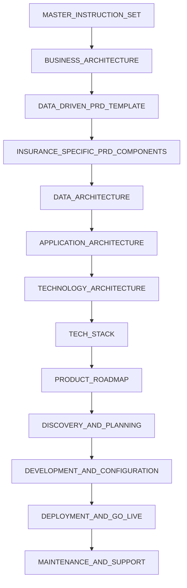
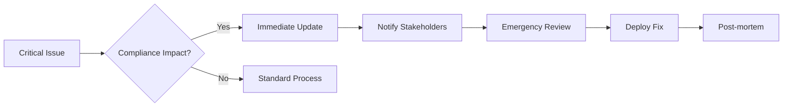

# SAGE Master Instruction Set
## Orchestrating Enterprise Documentation Excellence

### Document Pipeline Architecture

This master instruction set orchestrates the SAGE documentation framework for building enterprise-grade P&C insurance carrier systems. Each document serves a specific purpose in the development lifecycle and must be consumed in the prescribed order.

### Document Consumption Order



### Cross-Reference Matrix

| Document | Dependencies | Updates Trigger | Validation Gates |
|----------|--------------|-----------------|------------------|
| BUSINESS_ARCHITECTURE | None | PRD, APP_ARCH | Stakeholder approval |
| DATA_DRIVEN_PRD | BUS_ARCH | All downstream | SMART criteria met |
| INSURANCE_PRD_COMP | PRD | ARCH docs | Compliance review |
| DATA_ARCHITECTURE | PRD, BUS_ARCH | APP, TECH | Data governance approval |
| APPLICATION_ARCHITECTURE | DATA_ARCH | TECH, IMPL | Security review |
| TECHNOLOGY_ARCHITECTURE | APP_ARCH | STACK, IMPL | Infrastructure approval |
| TECH_STACK | TECH_ARCH | IMPL_PLAN | Cost analysis complete |
| PRODUCT_ROADMAP | All ARCH | IMPL phases | Executive approval |
| IMPLEMENTATION_PLAN/* | All above | Operations | Risk assessment |

### Document Validation Gates

Each document must pass quality gates before progression:

1. **Completeness Check**: All required sections populated
   - Automated validation via CI/CD
   - Template compliance scoring
   - Missing section alerts

2. **Consistency Validation**: Cross-references verified
   - Inter-document link checking
   - Version synchronization
   - Dependency validation

3. **Compliance Review**: Regulatory requirements met
   - NAIC checklist completion
   - SOC2 control mapping
   - PII handling verification

4. **Technical Accuracy**: Architecture alignment confirmed
   - TOGAF-ACORD compliance
   - Design pattern validation
   - Integration point verification

5. **AI-Assisted Review**: Cursor/Claude validation pass
   - Clarity and completeness check
   - Best practice alignment
   - Anti-pattern detection

### Living Documentation Integration

```yaml
documentation_pipeline:
  triggers:
    - code_changes:
        threshold: "significant"
        auto_update: ["API docs", "Architecture diagrams"]
    - architecture_decisions:
        create: "ADR"
        update: ["Tech Architecture", "Implementation Plan"]
    - compliance_updates:
        notify: ["Compliance Owner", "Product Owner"]
        update: ["PRD Components", "Data Architecture"]
    - roadmap_shifts:
        cascade: true
        approval_required: true
  
  automation:
    - generate_from_tests:
        tool: "Serenity BDD"
        frequency: "per_commit"
    - update_from_monitoring:
        source: ["Datadog", "CloudWatch"]
        target: ["Performance Metrics", "SLOs"]
    - sync_with_code:
        tool: "Cursor IDE"
        validation: "pre-commit"
    - validate_compliance:
        framework: "NAIC/SOC2"
        frequency: "weekly"
```

### Usage Instructions

#### Initial Setup
```bash
# Clone framework
git clone <framework-repo> ./docs/SAGE

# Initialize with project specifics
./docs/SAGE/init.sh --project-name="PolicyPro" \
                    --compliance="NAIC,SOC2,PII" \
                    --states="CA,NY,TX,FL"

# Validate structure
npm run docs:validate
```

#### Customization Workflow
1. **Replace Placeholders**: Use find-replace for `[placeholder]` values
2. **Configure Compliance**: Update regulatory requirements per state
3. **Set Integration Points**: Define CRM, policy systems connections
4. **Establish Metrics**: Define success criteria and KPIs
5. **Enable Automation**: Configure CI/CD hooks

#### AI-Assisted Workflow Integration

Configure your `.cursorrules` file:

```
# SAGE Documentation Context
docs_path: ./BASE_TEMPLATE_SAGE/
project_type: P&C Insurance Policy Management System
compliance_focus: NAIC, SOC2, PII, State-specific
architecture_framework: TOGAF-ACORD
development_approach: AI-assisted, test-driven, living-documentation

# Documentation Standards
- Use semantic versioning for all documents
- Maintain bidirectional traceability
- Generate diagrams from code where possible
- Keep examples current with implementation
- Flag assumptions and risks explicitly

# Auto-generation Rules
- PRD sections from user stories
- Architecture diagrams from code structure
- API documentation from OpenAPI specs
- Test documentation from BDD scenarios
```

### Document Health Metrics

#### Real-time Dashboard Metrics
```yaml
coverage_metrics:
  business_requirements: 
    target: 100%
    current: ${auto_calculated}
  technical_specifications:
    target: 95%
    current: ${auto_calculated}
  api_documentation:
    target: 100%
    current: ${auto_calculated}
  
currency_metrics:
  max_age_days: 30
  review_cycle: quarterly
  auto_flag_stale: true
  
quality_metrics:
  readability_score: 
    target: 60  # Flesch reading ease
  completeness_score:
    target: 95%
  accuracy_validation:
    method: "bi-weekly code sync"
```

### Continuous Improvement Protocol

1. **Weekly Reviews**: Document health check
2. **Monthly Audits**: Compliance alignment
3. **Quarterly Updates**: Framework enhancement
4. **Annual Overhaul**: Major version release

### Emergency Procedures

#### Documentation Hotfix Process


### Integration Points

#### Development Tools
- **IDE**: Cursor with custom rules
- **Version Control**: Git with protected branches
- **CI/CD**: GitHub Actions / GitLab CI
- **Monitoring**: Datadog / New Relic
- **Testing**: Serenity BDD / Cypress

#### Communication Channels
- **Slack Integration**: #docs-updates channel
- **Email Alerts**: Stakeholder notifications
- **JIRA Integration**: Auto-ticket creation
- **Confluence Sync**: Living documentation

---

**Document Version**: 1.0.0  
**Schema Version**: 2025.1  
**Last Updated**: ${auto_timestamp}  
**Next Review**: ${auto_calculated}  
**Owner**: [Documentation Team Lead]  
**Approval**: [CTO] | [Compliance Officer]