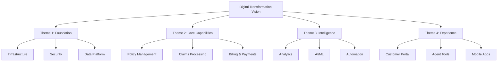
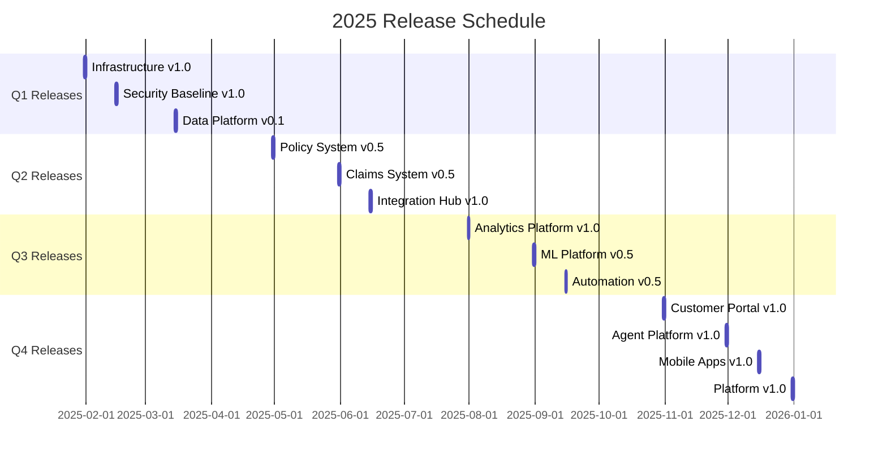
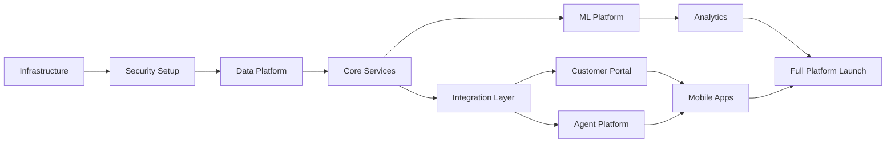

# Objective
Use this document as mandatory structured input. Preserve constraints, IDs, enums, thresholds, examples, and schemas.

# Product Roadmap Document
## P&C Insurance Platform - 12-Month Strategic Delivery Plan

### Document Metadata

| Field | Value |
|-------|-------|
| **Roadmap Period** | January 2025 - December 2025 |
| **Planning Horizon** | 12 Months |
| **Review Cycle** | Monthly |
| **Methodology** | Theme-based + OKR Aligned |
| **Status** | [Draft/Approved/In-Progress] |

### Executive Summary

This roadmap outlines the 12-month strategic delivery plan for building a next-generation P&C insurance platform. The roadmap is organized by strategic themes aligned with business objectives, enabling flexibility while maintaining clear direction.

### Strategic Themes

#### Theme Hierarchy



### OKR Alignment

#### Annual Objectives

```yaml
objective_1:
  title: "Accelerate Digital Insurance Operations"
  key_results:
    - kr1: "Reduce policy issuance time from 3 days to 30 minutes"
    - kr2: "Achieve 80% straight-through processing rate"
    - kr3: "Decrease operational costs by 35%"
    
objective_2:
  title: "Enhance Customer Experience"
  key_results:
    - kr1: "Achieve NPS score of 70+"
    - kr2: "Enable 24/7 self-service for 90% of transactions"
    - kr3: "Reduce customer effort score by 50%"
    
objective_3:
  title: "Build Intelligent Risk Platform"
  key_results:
    - kr1: "Improve underwriting accuracy to 95%"
    - kr2: "Reduce claims fraud by 40%"
    - kr3: "Decrease loss ratio by 5 points"
```

### Quarterly Roadmap

#### Q1 2025: Foundation Building

```yaml
theme: "Establish Core Infrastructure"
duration: "January - March 2025"

epics:
  infrastructure_setup:
    priority: P0
    deliverables:
      - Multi-cloud infrastructure deployment
      - Kubernetes platform setup
      - CI/CD pipeline establishment
      - Development environment provisioning
    success_metrics:
      - 99.9% platform availability
      - <5 min deployment time
      - 100% infrastructure as code
      
  security_foundation:
    priority: P0
    deliverables:
      - Zero-trust network implementation
      - Identity management system
      - Secrets management platform
      - Security monitoring setup
    success_metrics:
      - 0 security breaches
      - 100% MFA adoption
      - <1 hour incident response
      
  data_platform_core:
    priority: P0
    deliverables:
      - Data lake establishment
      - Real-time streaming setup
      - Master data management foundation
      - Data governance framework
    success_metrics:
      - 99% data availability
      - <1 second streaming latency
      - 100% data lineage tracking
```

**Q1 Milestones:**

| Milestone | Date | Success Criteria |
|-----------|------|------------------|
| Infrastructure Go-Live | Jan 31 | All environments operational |
| Security Baseline | Feb 15 | Compliance audit passed |
| Data Platform Alpha | Mar 15 | Core pipelines operational |
| Q1 Review & Demo | Mar 31 | 90% deliverables complete |

#### Q2 2025: Core Capabilities

```yaml
theme: "Build Essential Business Systems"
duration: "April - June 2025"

epics:
  policy_management_mvp:
    priority: P0
    deliverables:
      - Quote generation engine
      - Policy binding workflow
      - Document generation service
      - Rating engine integration
    success_metrics:
      - <30 second quote generation
      - 99% accuracy in calculations
      - 100% regulatory compliance
      
  claims_processing_foundation:
    priority: P0
    deliverables:
      - FNOL capture system
      - Claims workflow engine
      - Reserve management
      - Basic payment processing
    success_metrics:
      - <5 minute FNOL submission
      - 80% auto-adjudication rate
      - 100% audit trail compliance
      
  integration_layer:
    priority: P1
    deliverables:
      - CRM integration (Salesforce/HubSpot)
      - Payment gateway setup
      - Document management system
      - Email/SMS notifications
    success_metrics:
      - <2 second API response time
      - 99.9% integration uptime
      - 100% message delivery
```

**Q2 Milestones:**

| Milestone | Date | Success Criteria |
|-----------|------|------------------|
| Policy System Beta | Apr 30 | End-to-end flow working |
| Claims MVP Launch | May 31 | Basic claims processing live |
| Integration Testing | Jun 15 | All systems connected |
| Q2 Business Demo | Jun 30 | Business validation complete |

#### Q3 2025: Intelligence Layer

```yaml
theme: "Enable Data-Driven Decision Making"
duration: "July - September 2025"

epics:
  analytics_platform:
    priority: P0
    deliverables:
      - Business intelligence dashboards
      - Real-time analytics engine
      - Predictive models deployment
      - Executive reporting suite
    success_metrics:
      - <5 second dashboard load
      - 95% forecast accuracy
      - 100% KPI coverage
      
  ml_capabilities:
    priority: P1
    deliverables:
      - Risk scoring models
      - Fraud detection system
      - Customer churn prediction
      - Pricing optimization engine
    success_metrics:
      - >90% model accuracy
      - <100ms prediction latency
      - 30% fraud detection improvement
      
  automation_framework:
    priority: P1
    deliverables:
      - Underwriting automation
      - Claims auto-adjudication
      - Document extraction (OCR/NLP)
      - Workflow automation engine
    success_metrics:
      - 70% automation rate
      - 90% accuracy in extraction
      - 50% processing time reduction
```

**Q3 Milestones:**

| Milestone | Date | Success Criteria |
|-----------|------|------------------|
| Analytics Platform Live | Jul 31 | Core dashboards operational |
| ML Models in Production | Aug 31 | Risk & fraud models deployed |
| Automation Beta | Sep 15 | Key workflows automated |
| Q3 Innovation Showcase | Sep 30 | AI/ML capabilities demonstrated |

#### Q4 2025: Experience Excellence

```yaml
theme: "Deliver Superior User Experience"
duration: "October - December 2025"

epics:
  customer_portal:
    priority: P0
    deliverables:
      - Self-service portal
      - Policy management interface
      - Claims submission & tracking
      - Payment & billing center
    success_metrics:
      - <3 second page load
      - 90% task completion rate
      - 4.5+ user satisfaction score
      
  agent_platform:
    priority: P0
    deliverables:
      - Unified agent desktop
      - Quote & bind tools
      - Customer 360 view
      - Commission tracking
    success_metrics:
      - 50% efficiency improvement
      - <30 second quote time
      - 95% agent satisfaction
      
  mobile_experience:
    priority: P1
    deliverables:
      - iOS application
      - Android application
      - Mobile claims submission
      - Push notifications
    success_metrics:
      - 4.5+ app store rating
      - 60% mobile adoption
      - <2 second response time
```

**Q4 Milestones:**

| Milestone | Date | Success Criteria |
|-----------|------|------------------|
| Customer Portal Launch | Oct 31 | Public beta release |
| Agent Platform Rollout | Nov 30 | 100% agent adoption |
| Mobile Apps Release | Dec 15 | App store approval |
| Platform Go-Live | Dec 31 | Full production launch |

### Release Plan

#### Release Calendar



### Capacity & Resource Planning

#### Team Allocation

```yaml
team_structure:
  platform_team:
    size: 8 engineers
    focus: Infrastructure, security, shared services
    
  policy_team:
    size: 10 engineers
    focus: Policy management, underwriting, rating
    
  claims_team:
    size: 8 engineers
    focus: Claims processing, payments, fraud
    
  data_team:
    size: 6 engineers
    focus: Analytics, ML, data platform
    
  experience_team:
    size: 10 engineers
    focus: Web, mobile, agent tools
    
  qa_team:
    size: 8 engineers
    focus: Testing, automation, quality
    
total_capacity: 50 engineers
```

#### Skill Requirements

| Skill Area | Current | Required | Gap | Mitigation |
|------------|---------|----------|-----|------------|
| Cloud/DevOps | 60% | 100% | 40% | Training + Hiring |
| Microservices | 40% | 80% | 40% | Training program |
| Data/ML | 20% | 60% | 40% | Hiring + Partners |
| Insurance Domain | 50% | 80% | 30% | Domain training |

### Risk Management

#### Roadmap Risks

```yaml
risks:
  technical:
    - risk: "Legacy system integration complexity"
      impact: High
      probability: Medium
      mitigation: "Phased integration, API facades"
      
    - risk: "Performance at scale"
      impact: High
      probability: Low
      mitigation: "Load testing, auto-scaling"
      
  organizational:
    - risk: "Skills gap in cloud/ML"
      impact: Medium
      probability: High
      mitigation: "Training program, strategic hiring"
      
    - risk: "Change management resistance"
      impact: Medium
      probability: Medium
      mitigation: "Stakeholder engagement, phased rollout"
      
  external:
    - risk: "Regulatory changes"
      impact: High
      probability: Medium
      mitigation: "Flexible architecture, compliance buffer"
      
    - risk: "Vendor dependencies"
      impact: Medium
      probability: Low
      mitigation: "Multi-vendor strategy, abstractions"
```

### Dependencies

#### Critical Path Dependencies



### Success Metrics

#### Quarterly KPIs

| Quarter | Business Metrics | Technical Metrics | Quality Metrics |
|---------|-----------------|-------------------|-----------------|
| Q1 | Infrastructure ready | 99.9% uptime | 0 security incidents |
| Q2 | Core systems operational | <2s response time | >90% test coverage |
| Q3 | ML models deployed | >90% accuracy | <0.1% error rate |
| Q4 | Full platform live | 50K transactions/day | >95% satisfaction |

### Budget Allocation

#### Quarterly Budget Distribution

```yaml
budget_breakdown:
  q1_2025:
    infrastructure: 40%
    licenses: 30%
    consulting: 20%
    training: 10%
    total: $[amount]
    
  q2_2025:
    development: 50%
    integration: 25%
    testing: 15%
    operations: 10%
    total: $[amount]
    
  q3_2025:
    ml_platform: 35%
    analytics: 25%
    development: 30%
    operations: 10%
    total: $[amount]
    
  q4_2025:
    ux_development: 40%
    go_live_prep: 25%
    training: 20%
    buffer: 15%
    total: $[amount]
```

### Communication Plan

#### Stakeholder Updates

```yaml
communication_cadence:
  executive_briefing:
    frequency: Monthly
    format: Dashboard + presentation
    audience: C-suite
    
  steering_committee:
    frequency: Bi-weekly
    format: Progress report
    audience: VP level
    
  all_hands:
    frequency: Quarterly
    format: Demo + Q&A
    audience: All stakeholders
    
  team_updates:
    frequency: Weekly
    format: Stand-up + metrics
    audience: Development teams
```

### Change Management

#### Adoption Strategy

1. **Q1**: Foundation & awareness building
2. **Q2**: Pilot programs with early adopters
3. **Q3**: Expanded rollout with training
4. **Q4**: Full deployment with support

### Next Steps

1. **Immediate Actions**:
   - Finalize team structure
   - Complete infrastructure procurement
   - Kick-off Q1 initiatives

2. **30-Day Targets**:
   - Complete detailed Q1 planning
   - Onboard key resources
   - Establish governance structure

3. **Ongoing Activities**:
   - Monthly roadmap reviews
   - Quarterly replanning sessions
   - Continuous stakeholder engagement

---

**Approval Section**

| Role | Name | Signature | Date |
|------|------|-----------|------|
| Chief Product Officer | _______ | _______ | _____ |
| Chief Technology Officer | _______ | _______ | _____ |
| Business Sponsor | _______ | _______ | _____ |

**Document Control**  
- Review Cycle: Monthly
- Owner: Product Management
- Distribution: All Stakeholders