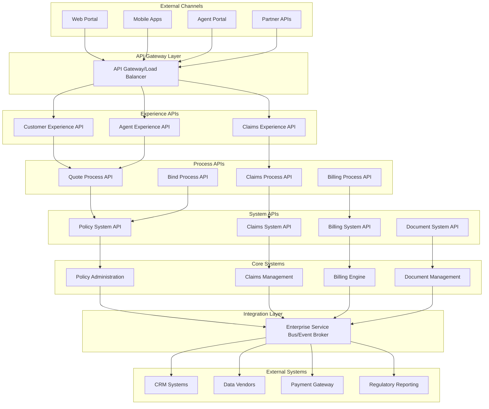
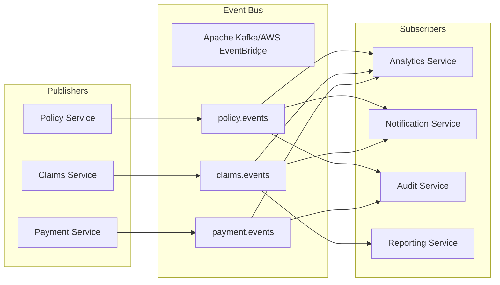
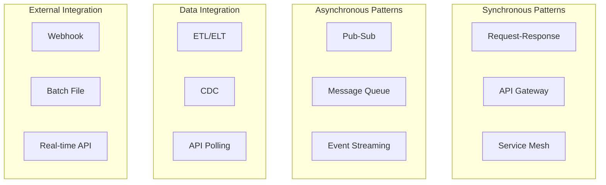
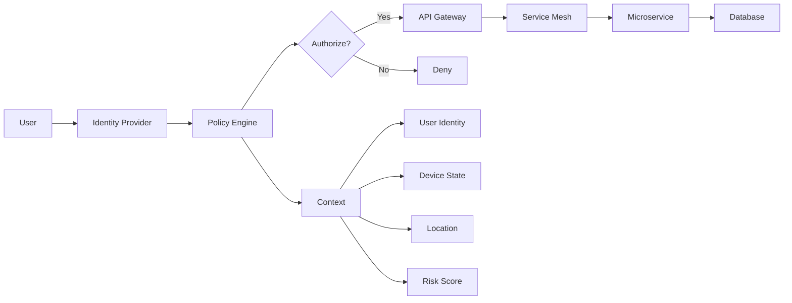
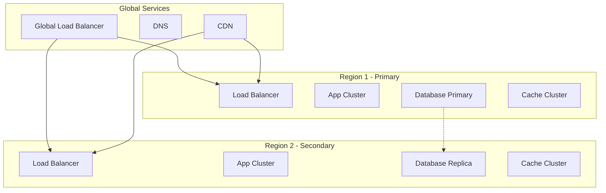
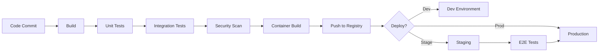

# Objective
Use this document as mandatory structured input. Preserve constraints, IDs, enums, thresholds, examples, and schemas.

# Application Architecture Document
## P&C Insurance Platform - Modern Cloud-Native Design

### Document Metadata

| Field | Value |
|-------|-------|
| **Architecture Domain** | Application Architecture |
| **Pattern Framework** | Microservices + Event-Driven |
| **Version** | 1.0.0 |
| **Cloud Strategy** | Multi-cloud Ready |
| **API Standard** | OpenAPI 3.1 |

### Executive Summary

This Application Architecture defines a modern, scalable, and resilient application landscape for P&C insurance operations. The architecture embraces cloud-native principles, microservices patterns, and event-driven design to support rapid innovation while maintaining enterprise-grade reliability.

### Architecture Vision & Principles

#### Guiding Principles

1. **API-First Design**: Every capability exposed as an API
2. **Cloud-Native**: Containerized, stateless, scalable
3. **Event-Driven**: Asynchronous, loosely coupled
4. **Domain-Driven**: Aligned with business capabilities
5. **Security-by-Design**: Zero-trust architecture
6. **Observability-First**: Full stack monitoring

### Application Landscape

#### High-Level Architecture



### Microservices Architecture

#### Service Catalog

**Core Business Services**

```yaml
policy_service:
  purpose: Manage policy lifecycle
  apis:
    - POST /policies/quote
    - POST /policies/bind
    - GET /policies/{id}
    - PUT /policies/{id}/endorse
    - POST /policies/{id}/renew
  events_published:
    - PolicyQuoted
    - PolicyBound
    - PolicyEndorsed
    - PolicyRenewed
  events_consumed:
    - PaymentProcessed
    - ClaimFiled
  database: PostgreSQL
  cache: Redis
  
claims_service:
  purpose: Handle claims processing
  apis:
    - POST /claims
    - GET /claims/{id}
    - PUT /claims/{id}/reserve
    - POST /claims/{id}/payments
  events_published:
    - ClaimFiled
    - ReserveSet
    - PaymentIssued
    - ClaimClosed
  events_consumed:
    - PolicyBound
    - PolicyEndorsed
  database: PostgreSQL
  cache: Redis
  
underwriting_service:
  purpose: Risk assessment and pricing
  apis:
    - POST /risks/assess
    - GET /risks/score/{id}
    - POST /pricing/calculate
  events_published:
    - RiskAssessed
    - PriceCalculated
  events_consumed:
    - ApplicationSubmitted
  database: MongoDB
  ml_models: 
    - risk_scoring_v2
    - price_optimization_v1
```

**Supporting Services**

```yaml
customer_service:
  purpose: Customer master data
  apis:
    - POST /customers
    - GET /customers/{id}
    - PUT /customers/{id}
  events_published:
    - CustomerCreated
    - CustomerUpdated
  database: PostgreSQL
  
document_service:
  purpose: Document generation and storage
  apis:
    - POST /documents/generate
    - GET /documents/{id}
    - POST /documents/upload
  storage: S3-compatible
  
notification_service:
  purpose: Multi-channel notifications
  apis:
    - POST /notifications/send
  channels:
    - email
    - sms
    - push
    - in-app
  
audit_service:
  purpose: Compliance and audit logging
  apis:
    - POST /audit/log
    - GET /audit/trail/{entity}
  storage: Immutable log store
```

### API Architecture

#### API Layers & Standards

**Experience APIs**
- Purpose: Channel-specific orchestration
- Standard: REST/GraphQL
- Authentication: OAuth 2.0 + JWT
- Rate Limiting: 1000 req/min per client

**Process APIs**
- Purpose: Business process orchestration
- Standard: REST
- Versioning: URI versioning (/v1, /v2)
- Documentation: OpenAPI 3.1

**System APIs**
- Purpose: System integration
- Standard: REST/gRPC
- Security: mTLS for service-to-service
- Circuit Breaker: Implemented

#### API Gateway Configuration

```yaml
api_gateway:
  provider: Kong/AWS API Gateway
  features:
    - request_routing
    - load_balancing
    - authentication
    - rate_limiting
    - request_transformation
    - response_caching
    - monitoring
    - circuit_breaker
    
  routes:
    - path: /api/v1/quotes/*
      service: quote_service
      methods: [GET, POST]
      auth: required
      rate_limit: 
        minute: 100
        hour: 1000
        
    - path: /api/v1/policies/*
      service: policy_service
      methods: [GET, POST, PUT]
      auth: required
      cache: 
        ttl: 300
        vary: [Authorization]
```

### Event-Driven Architecture

#### Event Bus Design



#### Event Catalog

```yaml
domain_events:
  policy:
    PolicyQuoted:
      schema: /schemas/policy/quoted/v1
      retention: 7 days
      partitioning: customer_id
      
    PolicyBound:
      schema: /schemas/policy/bound/v1
      retention: 7 years
      compliance: true
      
  claims:
    ClaimFiled:
      schema: /schemas/claims/filed/v1
      retention: 7 years
      priority: high
      
    PaymentIssued:
      schema: /schemas/claims/payment/v1
      retention: 7 years
      audit: required
```

### Data Architecture

#### Database Strategy

```yaml
database_patterns:
  operational:
    pattern: Database per Service
    technology: 
      - PostgreSQL (ACID transactions)
      - MongoDB (flexible schema)
    backup: Continuous replication
    
  analytical:
    pattern: CQRS with Event Sourcing
    technology:
      - Apache Kafka (event store)
      - Snowflake (data warehouse)
    refresh: Near real-time
    
  caching:
    pattern: Cache-aside
    technology: Redis Cluster
    ttl: Context-specific
    
  search:
    pattern: Dedicated search store
    technology: Elasticsearch
    sync: Change data capture
```

### Integration Architecture

#### Integration Patterns



#### External System Integration

```yaml
crm_integration:
  systems:
    salesforce:
      pattern: Bidirectional sync
      protocol: REST API
      authentication: OAuth 2.0
      sync_frequency: Near real-time
      error_handling: Dead letter queue
      
    hubspot:
      pattern: Event-driven update
      protocol: Webhooks
      authentication: API key
      retry_policy: Exponential backoff
      
data_vendors:
  lexisnexis:
    pattern: Request-response
    protocol: SOAP/XML
    authentication: Certificate
    timeout: 30 seconds
    cache: 24 hours
    
  experian:
    pattern: Batch lookup
    protocol: SFTP
    authentication: SSH key
    schedule: Daily 2 AM
    
payment_gateway:
  stripe:
    pattern: Synchronous API
    protocol: REST
    authentication: API key
    compliance: PCI DSS
    fallback: Queue for retry
```

### Security Architecture

#### Application Security Layers

```yaml
security_layers:
  edge_security:
    - ddos_protection
    - waf_rules
    - geo_blocking
    - rate_limiting
    
  api_security:
    - oauth2_authentication
    - api_key_management
    - jwt_validation
    - cors_policy
    
  service_security:
    - mtls_communication
    - service_mesh_policies
    - rbac_authorization
    - secrets_management
    
  data_security:
    - encryption_at_rest
    - encryption_in_transit
    - field_level_encryption
    - data_masking
```

#### Zero-Trust Implementation



### Deployment Architecture

#### Container Strategy

```yaml
containerization:
  platform: Kubernetes
  registry: Private ECR/ACR
  
  deployment_patterns:
    - blue_green
    - canary
    - rolling_update
    
  pod_specifications:
    web_tier:
      replicas: 3-10
      cpu: 500m-2000m
      memory: 512Mi-2Gi
      
    api_tier:
      replicas: 5-20
      cpu: 1000m-4000m
      memory: 1Gi-4Gi
      
    background_jobs:
      replicas: 2-5
      cpu: 2000m-8000m
      memory: 2Gi-8Gi
```

#### Multi-Region Architecture



### Monitoring & Observability

#### Observability Stack

```yaml
monitoring_stack:
  metrics:
    tool: Prometheus + Grafana
    collection_interval: 15s
    retention: 30 days
    
  logging:
    tool: ELK Stack / Splunk
    format: JSON structured
    retention: 90 days
    
  tracing:
    tool: Jaeger / AWS X-Ray
    sampling_rate: 1%
    retention: 7 days
    
  alerting:
    tool: PagerDuty / Opsgenie
    channels:
      - email
      - sms
      - slack
```

#### Key Metrics & SLIs

```yaml
service_level_indicators:
  availability:
    target: 99.9%
    measurement: Successful requests / Total requests
    
  latency:
    target: 
      p50: <200ms
      p95: <500ms
      p99: <1000ms
    measurement: Request duration
    
  error_rate:
    target: <0.1%
    measurement: 5xx errors / Total requests
    
  throughput:
    target: >1000 rps
    measurement: Requests per second
```

### Development & DevOps

#### CI/CD Pipeline



#### Development Standards

```yaml
development_standards:
  languages:
    backend:
      - Java 17+ (Spring Boot)
      - Python 3.9+ (FastAPI)
      - Go 1.19+ (Gin)
    frontend:
      - TypeScript 4.8+
      - React 18+
      - Next.js 13+
      
  code_quality:
    - linting: ESLint, Pylint, golangci-lint
    - formatting: Prettier, Black, gofmt
    - testing: >80% coverage
    - security: SAST/DAST scanning
    
  documentation:
    - API: OpenAPI 3.1
    - Code: JSDoc/Sphinx
    - Architecture: C4 Model
```

### Disaster Recovery

#### Recovery Strategy

```yaml
disaster_recovery:
  rto_rpo_targets:
    tier_1_critical:
      rto: 1 hour
      rpo: 15 minutes
      
    tier_2_important:
      rto: 4 hours
      rpo: 1 hour
      
    tier_3_standard:
      rto: 24 hours
      rpo: 4 hours
      
  backup_strategy:
    databases: Continuous replication
    files: Hourly snapshots
    configurations: Git versioned
    
  dr_testing:
    frequency: Quarterly
    type: Full failover
    documentation: Required
```

---

**Approval Section**

| Role | Name | Signature | Date |
|------|------|-----------|------|
| Chief Technology Officer | _______ | _______ | _____ |
| Chief Architect | _______ | _______ | _____ |
| Security Officer | _______ | _______ | _____ |

**Document Control**  
- Review Cycle: Quarterly
- Owner: Application Architecture Team
- Distribution: All Technical Teams