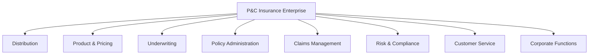
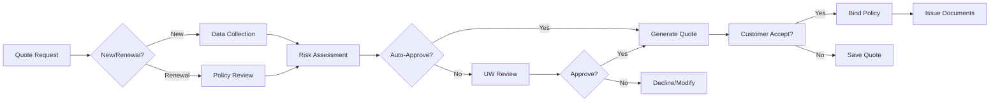
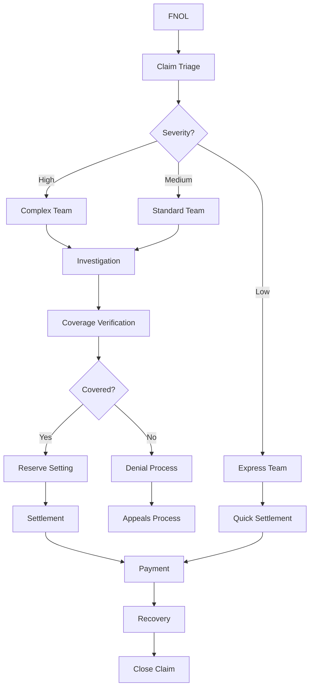
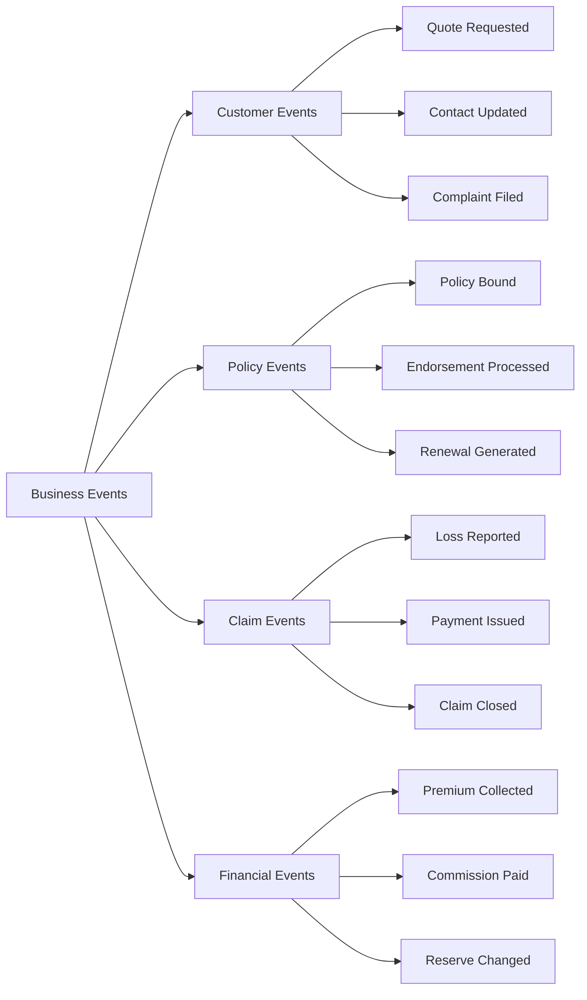
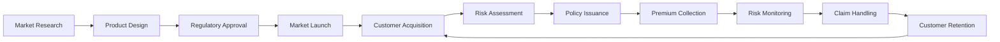

# Business Architecture Document
## P&C Insurance Carrier - TOGAF-ACORD Framework

### Document Metadata

| Field | Value |
|-------|-------|
| **Architecture Domain** | Business Architecture |
| **Framework** | TOGAF 9.2 + ACORD Insurance Standards |
| **Version** | 1.0.0 |
| **Status** | [Draft/Approved/Superseded] |
| **Review Cycle** | Quarterly |

### Executive Overview

This Business Architecture document defines the structure of business capabilities, processes, and information flows for a modern P&C insurance carrier platform. It aligns with TOGAF standards while incorporating ACORD's insurance-specific framework components.

### Business Capability Model

#### Level 1 - Enterprise Capabilities



#### Level 2 - Capability Decomposition

**Distribution Capabilities**
```yaml
distribution:
  channel_management:
    - agent_portal
    - broker_integration
    - direct_to_consumer
    - partnership_apis
    
  lead_management:
    - lead_capture
    - lead_scoring
    - lead_distribution
    - conversion_tracking
    
  commission_management:
    - commission_calculation
    - payment_processing
    - reconciliation
    - reporting
```

**Product & Pricing Capabilities**
```yaml
product_management:
  product_development:
    - market_analysis
    - product_design
    - regulatory_filing
    - launch_management
    
  pricing_strategy:
    - competitive_analysis
    - rate_development
    - actuarial_modeling
    - profitability_analysis
    
  product_configuration:
    - coverage_definition
    - rules_engine
    - forms_library
    - state_variations
```

**Underwriting Capabilities**
```yaml
underwriting:
  risk_assessment:
    - application_intake
    - data_enrichment
    - risk_scoring
    - decision_automation
    
  underwriting_rules:
    - guidelines_management
    - authority_matrix
    - referral_workflows
    - exception_handling
    
  portfolio_management:
    - exposure_analysis
    - concentration_management
    - reinsurance_optimization
    - performance_monitoring
```

### Business Process Architecture

#### Core Business Processes

**Quote-to-Bind Process**


**Claims Lifecycle Process**


### Information Architecture

#### Business Information Model

```yaml
core_business_entities:
  customer:
    attributes:
      - customer_id
      - demographics
      - contact_info
      - preferences
      - lifetime_value
    relationships:
      - policies: one_to_many
      - claims: one_to_many
      - interactions: one_to_many
      
  policy:
    attributes:
      - policy_number
      - effective_dates
      - coverages
      - premium
      - status
    relationships:
      - customer: many_to_one
      - risk_items: one_to_many
      - transactions: one_to_many
      - claims: one_to_many
      
  claim:
    attributes:
      - claim_number
      - loss_date
      - description
      - reserves
      - status
    relationships:
      - policy: many_to_one
      - claimant: one_to_many
      - payments: one_to_many
      - documents: one_to_many
```

#### Business Event Model



### Organizational Structure

#### Operating Model

```yaml
operating_model:
  type: Federated
  characteristics:
    - centralized_governance
    - distributed_execution
    - shared_services
    - local_autonomy
    
  organizational_units:
    corporate:
      - executive_leadership
      - strategy_planning
      - enterprise_architecture
      - risk_compliance
      
    business_units:
      - personal_lines
      - commercial_lines
      - specialty_lines
      
    shared_services:
      - it_services
      - actuarial_services
      - claims_operations
      - customer_service
      
    geographic_regions:
      - northeast
      - southeast
      - midwest
      - west
```

#### RACI Matrix - Key Processes

| Process | Product | Underwriting | IT | Compliance | Claims |
|---------|---------|--------------|----|-----------:|--------|
| Product Development | R,A | C | C | C,I | I |
| Rate Filing | R | C | I | A | I |
| System Changes | C | C | R | I,C | C |
| Claim Settlement | I | I | I | C | R,A |
| Regulatory Reporting | C | C | C | R,A | C |

*R=Responsible, A=Accountable, C=Consulted, I=Informed*

### Business Rules Architecture

#### Rule Categories

**Underwriting Rules**
```yaml
underwriting_rules:
  eligibility:
    auto:
      - driver_age: ">= 16"
      - license_status: "valid"
      - vehicle_age: "<= 20 years"
      
  pricing:
    factors:
      - credit_score_tier
      - territory_code
      - vehicle_symbol
      - driver_points
      
  authority:
    levels:
      junior: 
        max_premium: 5000
        max_liability: 300000
      senior:
        max_premium: 25000
        max_liability: 1000000
      manager:
        max_premium: unlimited
        max_liability: unlimited
```

**Claims Rules**
```yaml
claims_rules:
  fast_track:
    criteria:
      - claim_amount: "< 2500"
      - liability: "clear"
      - injuries: "none"
      
  authority_matrix:
    adjuster:
      settlement: 10000
      reserve: 25000
    supervisor:
      settlement: 50000
      reserve: 100000
    manager:
      settlement: 250000
      reserve: 500000
```

### Value Streams

#### Primary Value Stream - Risk Protection



**Value Stream Metrics**:
- Time to Market: Product concept to launch
- Customer Acquisition Cost
- Loss Ratio
- Customer Lifetime Value
- Retention Rate

### Business Architecture Principles

1. **Customer-Centricity**
   - Design all processes from customer perspective
   - Minimize customer effort
   - Provide omnichannel experience

2. **Data-Driven Decision Making**
   - Base decisions on analytics
   - Real-time performance monitoring
   - Predictive modeling integration

3. **Regulatory Compliance by Design**
   - Build compliance into processes
   - Automated compliance checking
   - Audit trail maintenance

4. **Operational Excellence**
   - Automate routine decisions
   - Standardize where possible
   - Continuous improvement culture

5. **Partner Ecosystem Integration**
   - Open architecture approach
   - API-first integration
   - Vendor-agnostic design

### Business Capability Heat Map

| Capability | Current Maturity | Target Maturity | Priority | Investment |
|------------|-----------------|-----------------|----------|------------|
| Digital Distribution | 2 - Developing | 4 - Advanced | High | $2M |
| Automated Underwriting | 2 - Developing | 5 - Optimized | Critical | $3M |
| Claims Automation | 3 - Defined | 4 - Advanced | High | $2.5M |
| Customer Analytics | 2 - Developing | 4 - Advanced | Medium | $1.5M |
| Product Innovation | 3 - Defined | 4 - Advanced | Medium | $1M |

*Maturity Scale: 1-Initial, 2-Developing, 3-Defined, 4-Advanced, 5-Optimized*

### Business Service Catalog

#### Customer-Facing Services

| Service | Description | Channels | SLA |
|---------|-------------|----------|-----|
| Quote Generation | Provide insurance quotes | Web, Mobile, Agent | <30 seconds |
| Policy Service | Policy changes, documents | All channels | <5 minutes |
| Claim Reporting | Report new claims | Phone, Web, Mobile | 24/7 availability |
| Payment Processing | Premium payments | Web, Auto-pay, Agent | Real-time |

#### Internal Services

| Service | Description | Consumers | SLA |
|---------|-------------|-----------|-----|
| Risk Scoring | Automated risk assessment | Underwriting, Agents | <2 seconds |
| Document Generation | Policy documents, letters | All departments | <1 minute |
| Compliance Checking | Regulatory validation | Product, Underwriting | Real-time |
| Analytics Services | Business intelligence | All departments | Daily refresh |

### Business Continuity Architecture

#### Critical Business Functions

```yaml
critical_functions:
  tier_1_immediate:
    - claim_intake
    - payment_processing
    - customer_service
    rto: 4 hours
    rpo: 1 hour
    
  tier_2_essential:
    - policy_issuance
    - underwriting
    - agent_portal
    rto: 24 hours
    rpo: 4 hours
    
  tier_3_important:
    - reporting
    - analytics
    - training
    rto: 72 hours
    rpo: 24 hours
```

### Performance Metrics Framework

#### Strategic Metrics

| Metric | Current | Target | Measurement |
|--------|---------|--------|-------------|
| Combined Ratio | 98.5% | 95% | Monthly |
| Customer Satisfaction | 78% | 90% | Quarterly |
| Digital Adoption | 35% | 70% | Monthly |
| Expense Ratio | 28% | 22% | Quarterly |

#### Operational Metrics

| Metric | Current | Target | Measurement |
|--------|---------|--------|-------------|
| Quote-to-Bind Ratio | 12% | 25% | Daily |
| Claims Cycle Time | 18 days | 7 days | Weekly |
| First Call Resolution | 65% | 85% | Daily |
| STP Rate | 40% | 80% | Daily |

### Governance Structure

#### Architecture Governance

```yaml
governance_bodies:
  architecture_board:
    charter: Strategic architecture decisions
    membership:
      - chief_architect
      - business_unit_heads
      - cto
      - compliance_officer
    frequency: Monthly
    
  design_authority:
    charter: Technical design standards
    membership:
      - solution_architects
      - technical_leads
      - security_architect
    frequency: Weekly
    
  change_advisory_board:
    charter: Change impact assessment
    membership:
      - operations
      - business_representatives
      - risk_management
    frequency: Weekly
```

---

**Approval Section**

| Role | Name | Signature | Date |
|------|------|-----------|------|
| Chief Business Officer | _______ | _______ | _____ |
| Chief Architect | _______ | _______ | _____ |
| Head of Strategy | _______ | _______ | _____ |

**Document Control**  
- Next Review: [Quarterly]
- Owner: Enterprise Architecture Team
- Distribution: All Business Leaders