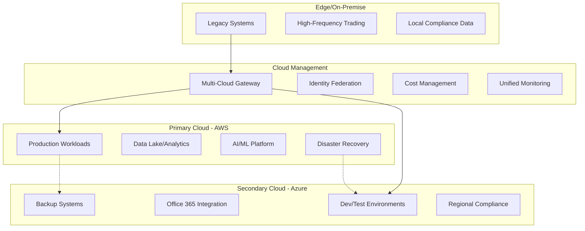
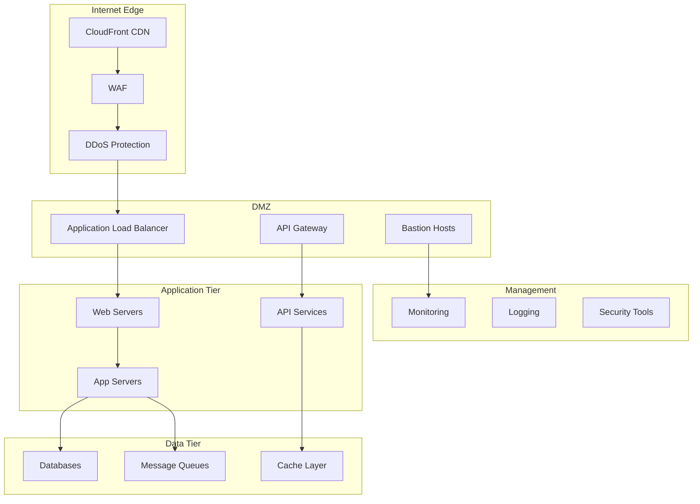
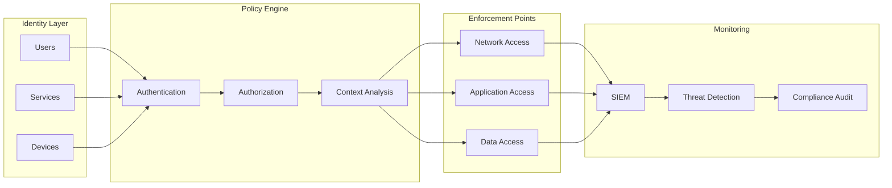
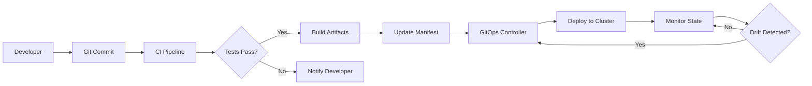
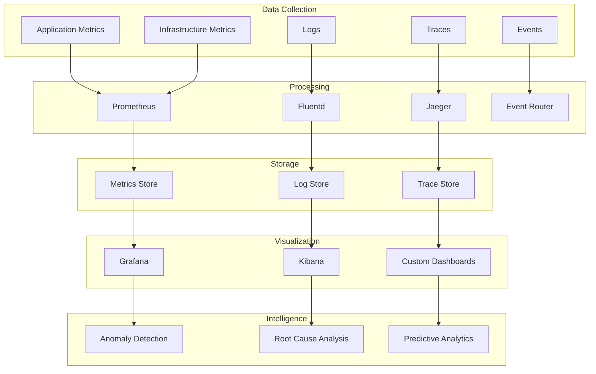
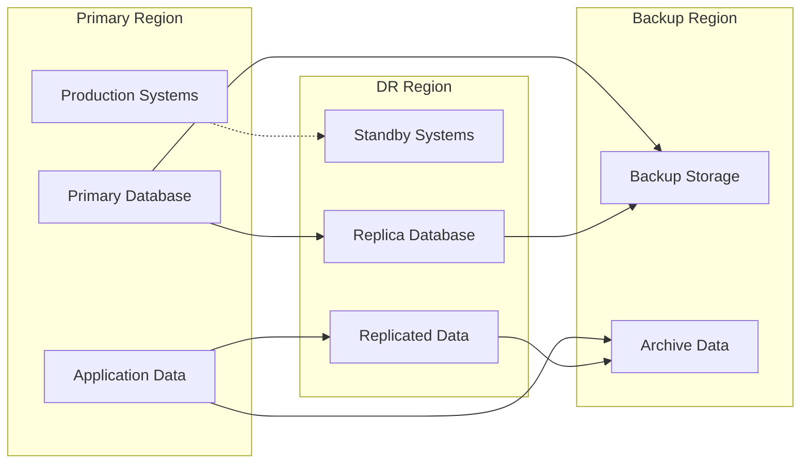

# Objective
Use this document as mandatory structured input. Preserve constraints, IDs, enums, thresholds, examples, and schemas.

# Technology Architecture Document
## P&C Insurance Platform Infrastructure

### Document Metadata

| Field | Value |
|-------|-------|
| **Architecture Domain** | Technology Architecture |
| **Cloud Strategy** | Hybrid Multi-Cloud |
| **Version** | 1.0.0 |
| **Framework** | TOGAF + Cloud Well-Architected |
| **Security Standard** | Zero Trust + NIST |

### Executive Summary

This Technology Architecture defines the infrastructure foundation supporting a modern P&C insurance platform. It encompasses cloud strategy, network design, security architecture, and operational excellence practices enabling scalable, secure, and resilient operations.

### Technology Vision & Principles

#### Guiding Principles

1. **Cloud-First**: Default to cloud, justify on-premise
2. **Infrastructure as Code**: Everything automated
3. **Security by Design**: Zero trust architecture
4. **Resilience Built-in**: No single points of failure
5. **Cost Optimized**: Right-sized and elastic
6. **Observable by Default**: Full-stack monitoring

### Cloud Architecture

#### Multi-Cloud Strategy



#### Cloud Service Utilization

```yaml
compute_services:
  containerized_workloads:
    primary: EKS/AKS
    orchestration: Kubernetes 1.26+
    service_mesh: Istio
    
  serverless_compute:
    functions: Lambda/Azure Functions
    use_cases:
      - Event processing
      - API backends
      - Scheduled tasks
      
  traditional_compute:
    vms: EC2/Azure VMs
    use_cases:
      - Legacy applications
      - Specialized workloads
      
storage_services:
  object_storage:
    primary: S3/Azure Blob
    use_cases:
      - Data lake
      - Backups
      - Static content
      
  block_storage:
    primary: EBS/Azure Disk
    use_cases:
      - Database storage
      - High IOPS workloads
      
  file_storage:
    primary: EFS/Azure Files
    use_cases:
      - Shared content
      - Application data
      
data_services:
  managed_databases:
    rdbms: RDS/Azure SQL
    nosql: DynamoDB/CosmosDB
    cache: ElastiCache/Azure Cache
    
  analytics:
    warehouse: Redshift/Synapse
    streaming: Kinesis/Event Hubs
    ml_platform: SageMaker/Azure ML
```

### Network Architecture

#### Network Design



#### Network Segmentation

```yaml
network_zones:
  public_subnet:
    cidr: 10.0.0.0/24
    components:
      - Load balancers
      - NAT gateways
      - Bastion hosts
    security: Security Group + NACL
    
  app_subnet:
    cidr: 10.0.1.0/24
    components:
      - Application servers
      - Container cluster
      - API services
    security: Microsegmentation
    
  data_subnet:
    cidr: 10.0.2.0/24
    components:
      - Databases
      - Cache clusters
      - Message brokers
    security: Private endpoints only
    
  management_subnet:
    cidr: 10.0.3.0/24
    components:
      - Monitoring tools
      - Security scanners
      - Backup systems
    security: Jump box access only
```

### Security Architecture

#### Zero Trust Security Model



#### Security Controls Framework

```yaml
preventive_controls:
  network_security:
    - network_segmentation
    - web_application_firewall
    - ddos_protection
    - vpn_access
    
  identity_access:
    - multi_factor_auth
    - privileged_access_management
    - service_accounts_rotation
    - least_privilege_access
    
  data_protection:
    - encryption_at_rest
    - encryption_in_transit
    - key_management_service
    - data_loss_prevention
    
detective_controls:
  monitoring:
    - security_information_event_management
    - intrusion_detection_system
    - file_integrity_monitoring
    - vulnerability_scanning
    
  logging:
    - centralized_log_management
    - audit_trail_integrity
    - log_retention_policy
    - real_time_alerting
    
responsive_controls:
  incident_response:
    - automated_remediation
    - security_orchestration
    - forensics_capability
    - incident_communication
```

### Infrastructure as Code

#### IaC Strategy

```yaml
iac_framework:
  provisioning:
    tool: Terraform
    version: 1.5+
    state_management: Remote with locking
    
  configuration:
    tool: Ansible
    version: 2.14+
    inventory: Dynamic
    
  policy:
    tool: Open Policy Agent
    rules: Security and compliance
    
  testing:
    - terraform_validate
    - tflint
    - checkov
    - inspec
    
directory_structure:
  ├── environments/
  │   ├── dev/
  │   ├── staging/
  │   └── prod/
  ├── modules/
  │   ├── networking/
  │   ├── compute/
  │   └── security/
  ├── policies/
  └── tests/
```

#### GitOps Workflow



### Container Platform

#### Kubernetes Architecture

```yaml
kubernetes_platform:
  cluster_configuration:
    version: 1.26+
    nodes:
      master: 3 (multi-az)
      worker: 5-50 (auto-scaling)
    networking: Calico CNI
    ingress: NGINX Ingress
    
  workload_management:
    namespaces:
      - production
      - staging
      - development
      - monitoring
      - security
      
  resource_quotas:
    production:
      cpu: 1000 cores
      memory: 4TB
      storage: 10TB
      
  security_policies:
    - pod_security_standards
    - network_policies
    - rbac_policies
    - admission_controllers
```

#### Service Mesh Configuration

```yaml
istio_configuration:
  traffic_management:
    - circuit_breakers
    - retry_policies
    - load_balancing
    - canary_deployments
    
  security:
    - mutual_tls
    - authorization_policies
    - certificate_management
    
  observability:
    - distributed_tracing
    - metrics_collection
    - service_topology
```

### Compute Infrastructure

#### Compute Sizing Guidelines

```yaml
workload_profiles:
  web_tier:
    instance_type: t3.large
    cpu: 2 vCPU
    memory: 8 GB
    scaling:
      min: 3
      max: 20
      target_cpu: 70%
      
  api_tier:
    instance_type: c5.xlarge
    cpu: 4 vCPU
    memory: 8 GB
    scaling:
      min: 5
      max: 50
      target_cpu: 60%
      
  processing_tier:
    instance_type: m5.2xlarge
    cpu: 8 vCPU
    memory: 32 GB
    scaling:
      min: 2
      max: 10
      target_memory: 70%
      
  ml_workloads:
    instance_type: p3.2xlarge
    gpu: 1x V100
    cpu: 8 vCPU
    memory: 61 GB
    scaling: Manual
```

### Storage Architecture

#### Storage Tiers

```yaml
storage_tiers:
  performance_tier:
    type: NVMe SSD
    iops: 64,000
    throughput: 1,000 MB/s
    use_cases:
      - Databases
      - Real-time analytics
      
  standard_tier:
    type: SSD
    iops: 16,000
    throughput: 250 MB/s
    use_cases:
      - Application data
      - Logs
      
  capacity_tier:
    type: HDD
    iops: 500
    throughput: 125 MB/s
    use_cases:
      - Backups
      - Archives
      
  archive_tier:
    type: Object storage
    retrieval_time: 12 hours
    use_cases:
      - Compliance archives
      - Long-term backups
```

### Database Infrastructure

#### Database Platform Strategy

```yaml
database_platforms:
  transactional:
    primary: PostgreSQL 14+
    ha_configuration:
      - Primary-standby replication
      - Automatic failover
      - Point-in-time recovery
    backup_strategy:
      - Continuous archiving
      - Daily snapshots
      - Cross-region replication
      
  analytical:
    primary: Snowflake
    configuration:
      - Multi-cluster warehouse
      - Auto-suspend/resume
      - Result caching
      
  nosql:
    document: MongoDB 6+
    key_value: Redis 7+
    wide_column: Cassandra 4+
    
  specialized:
    timeseries: TimescaleDB
    graph: Neo4j
    search: Elasticsearch
```

### Monitoring & Observability

#### Observability Stack



#### Monitoring Strategy

```yaml
monitoring_layers:
  infrastructure:
    metrics:
      - cpu_utilization
      - memory_usage
      - disk_io
      - network_throughput
    tools: CloudWatch, Datadog
    
  application:
    metrics:
      - response_time
      - error_rate
      - throughput
      - saturation
    tools: APM, Custom metrics
    
  business:
    metrics:
      - quote_conversion
      - policy_issuance_time
      - claim_processing_speed
      - customer_satisfaction
    tools: Custom dashboards
    
  security:
    metrics:
      - failed_logins
      - unusual_access_patterns
      - vulnerability_count
      - compliance_score
    tools: SIEM, CSPM
```

### Backup & Recovery

#### Backup Strategy

```yaml
backup_policies:
  databases:
    frequency: Continuous
    retention:
      daily: 7 days
      weekly: 4 weeks
      monthly: 12 months
      yearly: 7 years
    encryption: AES-256
    testing: Monthly restore test
    
  application_data:
    frequency: Daily
    retention:
      daily: 30 days
      monthly: 12 months
    method: Snapshot
    
  configuration:
    frequency: On change
    retention: Unlimited
    method: Version control
    
  compliance_data:
    frequency: Daily
    retention: 7 years
    immutability: WORM storage
    verification: Quarterly audit
```

### Disaster Recovery

#### DR Architecture



#### RTO/RPO Targets

| System Tier | RTO | RPO | DR Method |
|-------------|-----|-----|-----------|
| Tier 1 - Critical | 1 hour | 15 min | Hot standby |
| Tier 2 - Important | 4 hours | 1 hour | Warm standby |
| Tier 3 - Standard | 24 hours | 4 hours | Cold standby |
| Tier 4 - Non-critical | 72 hours | 24 hours | Backup restore |

### Performance Engineering

#### Performance Optimization

```yaml
optimization_strategies:
  caching:
    layers:
      - cdn: Static content
      - application: Session data
      - database: Query results
      - distributed: Shared data
      
  load_balancing:
    algorithms:
      - round_robin: Default
      - least_connections: API servers
      - ip_hash: Session affinity
      - weighted: A/B testing
      
  auto_scaling:
    metrics:
      - cpu: 70% threshold
      - memory: 80% threshold
      - requests: 1000 req/s
      - custom: Business metrics
      
  database_optimization:
    - query_optimization
    - index_management
    - connection_pooling
    - read_replicas
```

### Cost Management

#### Cost Optimization Framework

```yaml
cost_optimization:
  compute:
    - reserved_instances: 60%
    - spot_instances: 20%
    - on_demand: 20%
    - auto_shutdown: Non-production
    
  storage:
    - lifecycle_policies
    - compression
    - deduplication
    - tiered_storage
    
  network:
    - cdn_usage
    - vpc_endpoints
    - data_transfer_optimization
    
  monitoring:
    - cost_allocation_tags
    - budget_alerts
    - anomaly_detection
    - optimization_recommendations
```

### Capacity Planning

#### Capacity Model

```yaml
capacity_planning:
  growth_projections:
    users: 20% YoY
    data: 50% YoY
    transactions: 30% YoY
    
  scaling_thresholds:
    compute: 80% utilization
    storage: 85% capacity
    network: 70% bandwidth
    
  lead_times:
    cloud_resources: 1 hour
    on_premise: 4-6 weeks
    
  review_cycle: Quarterly
```

---

**Approval Section**

| Role | Name | Signature | Date |
|------|------|-----------|------|
| Chief Technology Officer | _______ | _______ | _____ |
| Chief Information Security Officer | _______ | _______ | _____ |
| Head of Infrastructure | _______ | _______ | _____ |

**Document Control**  
- Review Cycle: Quarterly
- Owner: Infrastructure Architecture Team
- Distribution: All Technical Teams