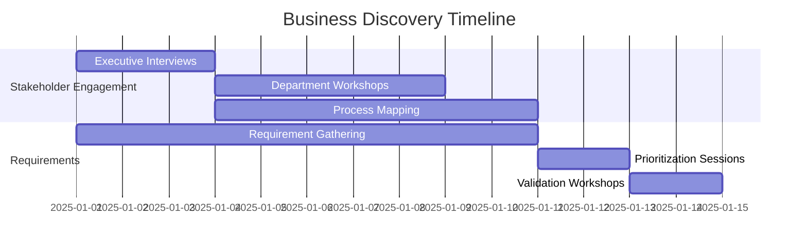
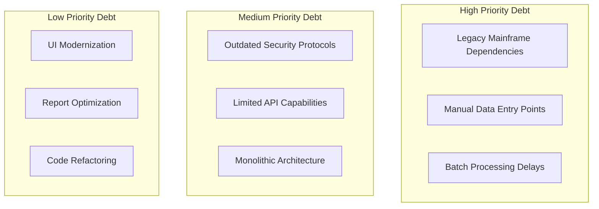
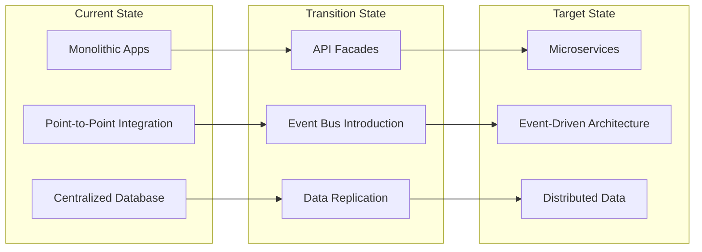
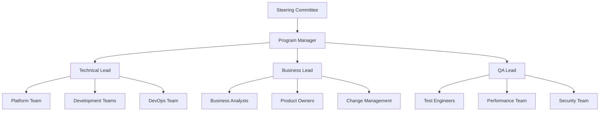

# Objective
Use this document as mandatory structured input. Preserve constraints, IDs, enums, thresholds, examples, and schemas.

# Discovery and Planning Phase
## Implementation Plan - Phase 1

### Document Metadata

| Field | Value |
|-------|-------|
| **Phase** | 1 of 4 |
| **Duration** | 8-12 Weeks |
| **Methodology** | Agile Discovery + TOGAF |
| **Version** | 1.0.0 |
| **Status** | [Not Started/In Progress/Complete] |

### Phase Overview

The Discovery and Planning phase establishes the foundation for successful implementation by thoroughly understanding business requirements, technical constraints, and stakeholder expectations while creating detailed implementation plans.

### Phase Objectives

```yaml
primary_objectives:
  - Validate business requirements and priorities
  - Assess current state architecture and systems
  - Define target state architecture
  - Identify risks and mitigation strategies
  - Create detailed project plan and resource allocation
  - Establish governance and communication structures
  
success_criteria:
  - 100% stakeholder alignment on scope
  - Approved target architecture
  - Signed-off project charter
  - Committed resource allocation
  - Baselined project plan
  - Risk register established
```

### Discovery Activities

#### Week 1-2: Business Discovery



**Stakeholder Analysis Matrix**

| Stakeholder Group | Interest | Influence | Engagement Strategy | Key Concerns |
|-------------------|----------|-----------|-------------------|--------------|
| Executive Sponsors | High | High | Weekly briefings | ROI, Timeline |
| Business Users | High | Medium | Bi-weekly demos | Usability, Training |
| IT Operations | Medium | High | Technical reviews | Integration, Support |
| Compliance Team | High | Medium | Regular checkpoints | Regulatory adherence |
| Customers | Low | Low | Surveys, feedback | Service continuity |

**Business Process Inventory**

```yaml
core_processes:
  policy_lifecycle:
    current_state:
      - duration: 3-5 days
      - systems: 7 different
      - manual_steps: 45%
      - error_rate: 8%
    target_state:
      - duration: <30 minutes
      - systems: 1 unified
      - manual_steps: <10%
      - error_rate: <1%
      
  claims_processing:
    current_state:
      - fnol_time: 45 minutes
      - processing_days: 14-21
      - auto_adjudication: 15%
      - customer_touches: 8-12
    target_state:
      - fnol_time: <5 minutes
      - processing_days: 3-5
      - auto_adjudication: >70%
      - customer_touches: 2-3
```

#### Week 3-4: Technical Discovery

**System Assessment Checklist**

```yaml
current_systems_assessment:
  policy_admin_system:
    vendor: [Legacy Vendor]
    version: [X.X]
    age: [Years]
    technical_debt: [High/Medium/Low]
    integration_apis: [Available/Limited/None]
    data_quality: [Score 1-10]
    documentation: [Complete/Partial/None]
    
  claims_system:
    vendor: [Vendor Name]
    version: [X.X]
    customizations: [Heavy/Moderate/Light]
    performance_issues: [List]
    scalability_limits: [Metrics]
    
  integration_landscape:
    total_integrations: [Number]
    real_time: [Count]
    batch: [Count]
    file_based: [Count]
    api_based: [Count]
```

**Technical Debt Analysis**



#### Week 5-6: Architecture Planning

**Target Architecture Definition**

```yaml
architecture_decisions:
  application_architecture:
    pattern: Microservices
    rationale: "Scalability, independent deployment, technology diversity"
    risks: "Complexity, distributed system challenges"
    
  data_architecture:
    pattern: "Data Mesh + Central Governance"
    rationale: "Domain ownership, scalability, quality"
    risks: "Coordination overhead, skill requirements"
    
  integration_architecture:
    pattern: "Event-driven + API Gateway"
    rationale: "Loose coupling, real-time processing"
    risks: "Event ordering, consistency"
    
  security_architecture:
    pattern: "Zero Trust"
    rationale: "Modern security posture, cloud-ready"
    risks: "Implementation complexity, user experience"
```

**Architecture Transition Plan**



### Planning Deliverables

#### Week 7-8: Detailed Planning

**Project Charter**

```yaml
project_charter:
  project_name: "P&C Insurance Digital Platform"
  business_case:
    problem_statement: |
      Current systems unable to meet digital customer expectations
      High operational costs due to manual processes
      Limited ability to innovate and launch new products
    
  objectives:
    - Reduce policy issuance time by 90%
    - Decrease operational costs by 35%
    - Enable 24/7 self-service capabilities
    - Achieve 95% straight-through processing
    
  scope:
    in_scope:
      - Policy administration modernization
      - Claims processing automation
      - Customer/agent portals
      - Analytics platform
    out_scope:
      - Financial/GL systems
      - HR systems
      - Email infrastructure
      
  timeline: 12 months
  budget: $[Amount]
  
  success_metrics:
    - business_metrics: [List]
    - technical_metrics: [List]
    - quality_metrics: [List]
```

**Work Breakdown Structure (WBS)**

```yaml
wbs_level_1:
  1_project_management:
    - 1.1_initiation
    - 1.2_planning
    - 1.3_execution_control
    - 1.4_closure
    
  2_infrastructure:
    - 2.1_cloud_setup
    - 2.2_networking
    - 2.3_security
    - 2.4_monitoring
    
  3_platform_development:
    - 3.1_core_services
    - 3.2_business_logic
    - 3.3_integrations
    - 3.4_user_interfaces
    
  4_data_migration:
    - 4.1_assessment
    - 4.2_extraction
    - 4.3_transformation
    - 4.4_loading
    
  5_testing:
    - 5.1_unit_testing
    - 5.2_integration_testing
    - 5.3_performance_testing
    - 5.4_uat
    
  6_deployment:
    - 6.1_environment_prep
    - 6.2_deployment_automation
    - 6.3_rollout
    - 6.4_validation
```

### Resource Planning

#### Team Structure



**Resource Allocation Matrix**

| Role | Count | Start Date | Duration | Allocation % |
|------|-------|------------|----------|--------------|
| Program Manager | 1 | Week 1 | 12 months | 100% |
| Technical Architect | 2 | Week 1 | 12 months | 100% |
| Business Analysts | 4 | Week 1 | 12 months | 100% |
| Developers | 20 | Week 9 | 10 months | 100% |
| DevOps Engineers | 4 | Week 5 | 12 months | 100% |
| QA Engineers | 8 | Week 13 | 9 months | 100% |
| Security Engineers | 2 | Week 5 | 12 months | 50% |

### Risk Assessment

#### Risk Register

```yaml
risks:
  high_priority:
    - id: R001
      category: Technical
      description: "Legacy system integration complexity"
      probability: High
      impact: High
      mitigation:
        - Detailed integration analysis
        - API facade pattern
        - Phased migration approach
      owner: Technical Architect
      
    - id: R002
      category: Organizational
      description: "Stakeholder resistance to change"
      probability: Medium
      impact: High
      mitigation:
        - Change management program
        - Regular communication
        - Quick wins demonstration
      owner: Change Manager
      
  medium_priority:
    - id: R003
      category: Resource
      description: "Key skill gaps in cloud/microservices"
      probability: High
      impact: Medium
      mitigation:
        - Training program
        - Strategic hiring
        - Partner augmentation
      owner: HR Lead
```

### Communication Plan

#### Stakeholder Communication Matrix

| Audience | Method | Frequency | Content | Owner |
|----------|--------|-----------|---------|-------|
| Steering Committee | Meeting | Weekly | Status, risks, decisions | Program Manager |
| Business Users | Workshop | Bi-weekly | Progress, demos | Product Owner |
| Technical Teams | Stand-up | Daily | Tasks, blockers | Scrum Master |
| All Stakeholders | Newsletter | Monthly | Milestones, updates | Communications |

### Quality Gates

#### Phase Exit Criteria

```yaml
exit_criteria:
  mandatory:
    - [ ] Business requirements documented and approved
    - [ ] Technical assessment completed
    - [ ] Target architecture approved by ARB
    - [ ] Project charter signed by sponsors
    - [ ] Resource allocation confirmed
    - [ ] Risk mitigation plans approved
    - [ ] Vendor contracts finalized
    - [ ] Infrastructure provisioning started
    
  quality_checks:
    - [ ] Requirements traceability matrix created
    - [ ] Architecture decision records documented
    - [ ] RACI matrix approved
    - [ ] Communication plan activated
    - [ ] Baseline metrics captured
    - [ ] Success criteria defined and measurable
```

### Tools and Templates

#### Discovery Tools

```yaml
tools_used:
  process_mapping: Visio / Miro
  requirements: JIRA / Azure DevOps
  architecture: Enterprise Architect / Draw.io
  project_planning: MS Project / Smartsheet
  collaboration: Confluence / SharePoint
  
templates:
  - business_process_template.xlsx
  - technical_assessment_checklist.docx
  - architecture_decision_record.md
  - risk_register_template.xlsx
  - stakeholder_analysis_matrix.pptx
```

### Budget Planning

#### Phase 1 Budget Breakdown

```yaml
budget_allocation:
  consulting:
    business_analysis: $[amount]
    technical_assessment: $[amount]
    architecture_design: $[amount]
    subtotal: $[amount]
    
  tools_licenses:
    project_management: $[amount]
    architecture_tools: $[amount]
    collaboration: $[amount]
    subtotal: $[amount]
    
  resources:
    internal_backfill: $[amount]
    training: $[amount]
    subtotal: $[amount]
    
  contingency: 15%
  
  total_phase_1: $[amount]
```

### Lessons Learned Integration

#### Previous Project Insights

1. **Start security and compliance early** - Don't treat as afterthought
2. **Invest in stakeholder alignment** - Prevents scope creep
3. **Document decisions thoroughly** - Saves rework later
4. **Plan for data quality issues** - Always worse than expected
5. **Include operational readiness** - Often overlooked

### Phase Transition

#### Handover to Development Phase

```yaml
transition_checklist:
  deliverables:
    - [ ] Approved requirements document
    - [ ] Signed technical architecture
    - [ ] Detailed project plan
    - [ ] Risk mitigation strategies
    - [ ] Resource onboarding plan
    - [ ] Environment provisioning status
    
  knowledge_transfer:
    - [ ] Architecture walkthrough sessions
    - [ ] Business process training
    - [ ] Technical deep-dives
    - [ ] Tool access provisioned
    
  success_criteria:
    - [ ] Development team onboarded
    - [ ] Environments accessible
    - [ ] First sprint planned
    - [ ] Governance established
```

---

**Sign-off Section**

| Role | Name | Signature | Date |
|------|------|-----------|------|
| Program Manager | _______ | _______ | _____ |
| Technical Lead | _______ | _______ | _____ |
| Business Sponsor | _______ | _______ | _____ |

**Document Control**  
- Phase Status: [Not Started/In Progress/Complete]
- Last Updated: [Date]
- Next Review: [Date]