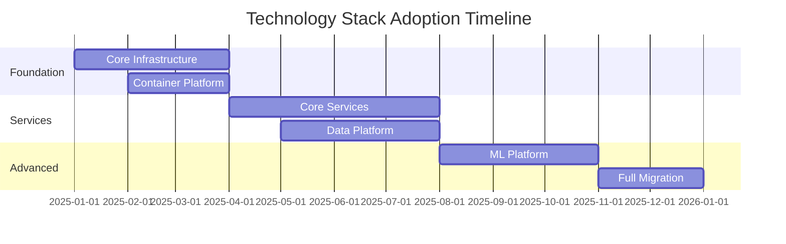

# Technology Stack Document
## P&C Insurance Platform - 2025-2026 Technology Choices

### Document Metadata

| Field | Value |
|-------|-------|
| **Stack Version** | 2025.1.0 |
| **Architecture Style** | Microservices + Event-Driven |
| **Cloud Strategy** | Multi-Cloud (AWS Primary) |
| **Review Cycle** | Bi-annual |
| **Decision Framework** | TOGAF + TCO Analysis |

### Executive Summary

This document defines the technology stack for building a modern P&C insurance platform. Technology selections are based on industry best practices, team expertise, scalability requirements, and total cost of ownership (TCO) analysis.

### Technology Selection Criteria

#### Evaluation Framework

```yaml
selection_criteria:
  technical_fit:
    weight: 30%
    factors:
      - Performance requirements
      - Scalability needs
      - Integration capabilities
      - Security features
      
  organizational_fit:
    weight: 25%
    factors:
      - Team expertise
      - Learning curve
      - Community support
      - Vendor stability
      
  financial_impact:
    weight: 25%
    factors:
      - Licensing costs
      - Operational costs
      - Training costs
      - Support costs
      
  strategic_alignment:
    weight: 20%
    factors:
      - Future roadmap
      - Vendor lock-in
      - Innovation potential
      - Market adoption
```

### Core Technology Stack

#### Programming Languages

```yaml
backend_languages:
  primary:
    language: Java
    version: 17+ LTS
    framework: Spring Boot 3.x
    use_cases:
      - Core business services
      - Transaction processing
      - Integration services
    rationale: "Mature ecosystem, strong typing, enterprise support"
    
  secondary:
    language: Python
    version: 3.11+
    framework: FastAPI
    use_cases:
      - Data processing
      - ML/AI services
      - Scripting/automation
    rationale: "Data science ecosystem, rapid development"
    
  specialized:
    language: Go
    version: 1.20+
    framework: Gin/Echo
    use_cases:
      - High-performance services
      - System utilities
      - Cloud-native tools
    rationale: "Performance, concurrency, cloud-native"
    
frontend_languages:
  primary:
    language: TypeScript
    version: 5.0+
    framework: React 18+
    use_cases:
      - Web applications
      - Progressive web apps
    rationale: "Type safety, ecosystem, developer productivity"
    
  mobile:
    language: React Native
    version: 0.72+
    use_cases:
      - iOS applications
      - Android applications
    rationale: "Code reuse, unified development"
```

#### Frameworks & Libraries

```yaml
backend_frameworks:
  web_framework:
    java:
      - Spring Boot 3.x
      - Spring Cloud 2022.x
      - Spring Security 6.x
    python:
      - FastAPI 0.100+
      - SQLAlchemy 2.0+
      - Pydantic 2.0+
    go:
      - Gin 1.9+
      - Echo 4.x
      - Fiber 2.x
      
  messaging:
    - Apache Kafka 3.5+
    - RabbitMQ 3.12+
    - Redis Streams 7.0+
    
  data_processing:
    - Apache Spark 3.4+
    - Apache Flink 1.17+
    - DBT 1.5+
    
frontend_frameworks:
  ui_framework:
    - React 18+
    - Next.js 13+
    - Material-UI 5.x
    
  state_management:
    - Redux Toolkit 1.9+
    - TanStack Query 4.x
    - Zustand 4.x
    
  build_tools:
    - Vite 4.x
    - Webpack 5.x
    - ESBuild
```

### Data Layer

#### Databases

```yaml
relational_databases:
  primary:
    name: PostgreSQL
    version: 15+
    use_cases:
      - Transactional data
      - Policy management
      - Claims processing
    features:
      - ACID compliance
      - JSON support
      - Partitioning
      - Replication
    hosting: "AWS RDS / Self-managed"
    
  analytics:
    name: Snowflake
    use_cases:
      - Data warehouse
      - Analytics
      - Reporting
    features:
      - Elastic scaling
      - Data sharing
      - Time travel
    
nosql_databases:
  document_store:
    name: MongoDB
    version: 6.0+
    use_cases:
      - Content management
      - Product catalog
      - Flexible schemas
    hosting: "MongoDB Atlas / Self-managed"
    
  key_value:
    name: Redis
    version: 7.0+
    use_cases:
      - Caching
      - Session management
      - Real-time features
    features:
      - Redis Streams
      - Redis Modules
      - Cluster mode
      
  wide_column:
    name: Cassandra
    version: 4.1+
    use_cases:
      - Time-series data
      - Audit logs
      - High-write workloads
```

#### Data Processing

```yaml
batch_processing:
  framework: Apache Spark
  version: 3.4+
  use_cases:
    - ETL pipelines
    - Data transformation
    - ML preprocessing
  deployment: "EMR / Databricks"
  
stream_processing:
  framework: Apache Flink
  version: 1.17+
  use_cases:
    - Real-time analytics
    - Event processing
    - Fraud detection
    
orchestration:
  tool: Apache Airflow
  version: 2.6+
  alternatives:
    - Prefect 2.x
    - Dagster 1.x
  use_cases:
    - Workflow management
    - Data pipelines
    - Job scheduling
```

### Infrastructure & Cloud

#### Cloud Platforms

```yaml
cloud_providers:
  primary:
    provider: AWS
    services:
      compute:
        - EC2
        - ECS/EKS
        - Lambda
      storage:
        - S3
        - EBS
        - EFS
      database:
        - RDS
        - DynamoDB
        - ElastiCache
      analytics:
        - Redshift
        - Athena
        - EMR
      ml:
        - SageMaker
        - Comprehend
        - Forecast
        
  secondary:
    provider: Azure
    use_cases:
      - Office 365 integration
      - .NET workloads
      - Regional compliance
      
  multi_cloud_tools:
    - Terraform
    - Kubernetes
    - Prometheus
```

#### Container & Orchestration

```yaml
containerization:
  runtime: Docker
  version: 24.x
  registry: "ECR / Harbor"
  
orchestration:
  platform: Kubernetes
  version: 1.27+
  distribution: "EKS / Self-managed"
  addons:
    networking: Calico
    ingress: NGINX Ingress
    service_mesh: Istio
    monitoring: Prometheus Operator
    
  gitops:
    tool: ArgoCD
    version: 2.8+
    alternatives:
      - Flux 2.x
      - Rancher Fleet
```

### API & Integration

#### API Technologies

```yaml
api_gateway:
  primary: Kong
  version: 3.4+
  features:
    - Rate limiting
    - Authentication
    - Transformation
    - Analytics
  alternatives:
    - AWS API Gateway
    - Apigee
    
api_protocols:
  rest:
    specification: OpenAPI 3.1
    framework: Spring Boot / FastAPI
    
  graphql:
    server: Apollo Server
    version: 4.x
    use_cases:
      - Mobile BFF
      - Complex queries
      
  grpc:
    version: 1.56+
    use_cases:
      - Service-to-service
      - High performance
      
  async_api:
    specification: AsyncAPI 2.6
    use_cases:
      - Event documentation
      - Webhook contracts
```

#### Integration Platforms

```yaml
enterprise_integration:
  esb_alternative: Apache Camel
  version: 4.0+
  patterns:
    - Content-based routing
    - Message transformation
    - Protocol mediation
    
event_streaming:
  platform: Apache Kafka
  version: 3.5+
  ecosystem:
    - Kafka Connect
    - Kafka Streams
    - Schema Registry
    - KSQL
    
message_queue:
  platform: RabbitMQ
  version: 3.12+
  use_cases:
    - Task queues
    - Pub/sub
    - RPC
```

### Security Stack

#### Security Tools

```yaml
application_security:
  sast:
    tool: SonarQube
    version: 10.x
    alternatives:
      - Checkmarx
      - Veracode
      
  dast:
    tool: OWASP ZAP
    alternatives:
      - Burp Suite
      - Rapid7
      
  dependency_scanning:
    tool: Snyk
    alternatives:
      - WhiteSource
      - Black Duck
      
infrastructure_security:
  secrets_management:
    tool: HashiCorp Vault
    version: 1.14+
    alternatives:
      - AWS Secrets Manager
      - Azure Key Vault
      
  policy_as_code:
    tool: Open Policy Agent
    version: 0.54+
    use_cases:
      - Authorization
      - Compliance
      - Admission control
      
  vulnerability_scanning:
    tool: Trivy
    alternatives:
      - Clair
      - Anchore
```

### Monitoring & Observability

#### Observability Stack

```yaml
metrics:
  collection: Prometheus
  version: 2.45+
  storage: "Thanos / Cortex"
  visualization: Grafana 10.x
  
logging:
  collection: Fluentd
  version: 1.16+
  storage: Elasticsearch 8.x
  visualization: Kibana 8.x
  alternatives:
    - Loki + Grafana
    - Splunk
    
tracing:
  collection: OpenTelemetry
  storage: Jaeger
  version: 1.47+
  alternatives:
    - Zipkin
    - AWS X-Ray
    
apm:
  tool: Datadog
  alternatives:
    - New Relic
    - AppDynamics
    - Elastic APM
```

### Development Tools

#### IDE & Editors

```yaml
development_environments:
  ide:
    java: IntelliJ IDEA
    python: PyCharm / VS Code
    javascript: VS Code
    
  ai_assisted:
    primary: Cursor
    features:
      - Code completion
      - Documentation generation
      - Bug detection
      - Refactoring suggestions
      
  extensions:
    - ESLint
    - Prettier
    - GitLens
    - Docker
    - Kubernetes
```

#### CI/CD Pipeline

```yaml
version_control:
  platform: GitLab
  alternatives:
    - GitHub Enterprise
    - Bitbucket
    
ci_cd:
  platform: GitLab CI
  alternatives:
    - Jenkins
    - GitHub Actions
    - CircleCI
    
  pipeline_stages:
    - build
    - test
    - security_scan
    - package
    - deploy
    
artifact_repository:
  maven: Nexus
  docker: Harbor
  npm: Nexus
  pypi: Nexus
```

### Testing Stack

#### Testing Frameworks

```yaml
unit_testing:
  java: JUnit 5 + Mockito
  python: pytest + pytest-mock
  javascript: Jest + React Testing Library
  
integration_testing:
  api: REST Assured / Postman
  database: Testcontainers
  messaging: Embedded Kafka
  
e2e_testing:
  web: Cypress / Playwright
  mobile: Appium
  api: Karate DSL
  
performance_testing:
  tool: k6
  alternatives:
    - JMeter
    - Gatling
    - Locust
    
chaos_engineering:
  tool: Chaos Monkey
  alternatives:
    - Litmus
    - Gremlin
```

### Machine Learning Stack

#### ML/AI Technologies

```yaml
ml_frameworks:
  training:
    - TensorFlow 2.13+
    - PyTorch 2.0+
    - Scikit-learn 1.3+
    
  deployment:
    platform: MLflow
    version: 2.5+
    serving:
      - SageMaker
      - KServe
      - BentoML
      
  feature_store:
    tool: Feast
    version: 0.32+
    alternatives:
      - Tecton
      - Hopsworks
      
  experiment_tracking:
    tool: MLflow
    alternatives:
      - Weights & Biases
      - Neptune.ai
```

### Documentation Tools

#### Documentation Stack

```yaml
api_documentation:
  tool: Swagger UI
  specification: OpenAPI 3.1
  
technical_documentation:
  tool: MkDocs
  theme: Material
  plugins:
    - mermaid
    - search
    - pdf-export
    
knowledge_base:
  platform: Confluence
  alternatives:
    - GitBook
    - Docusaurus
    
architecture_diagrams:
  tool: draw.io
  as_code:
    - PlantUML
    - Mermaid
    - C4 Model
```

### Technology Governance

#### Standards & Guidelines

```yaml
coding_standards:
  java: Google Java Style Guide
  python: PEP 8 + Black
  javascript: Airbnb Style Guide
  
api_standards:
  rest: RESTful API Guidelines
  naming: camelCase / snake_case
  versioning: URI versioning
  
security_standards:
  - OWASP Top 10
  - CIS Benchmarks
  - NIST Guidelines
  
documentation_standards:
  - README templates
  - API documentation
  - Architecture decisions
  - Runbooks
```

### Migration & Adoption Plan

#### Technology Adoption Phases



### Cost Analysis

#### TCO Breakdown

```yaml
cost_analysis:
  licensing:
    open_source: 70%
    commercial: 30%
    annual_cost: $[amount]
    
  infrastructure:
    cloud_services: $[amount]/month
    on_premise: $[amount]/year
    
  operational:
    training: $[amount]
    support: $[amount]/year
    consulting: $[amount]
    
  roi_timeline: 18 months
```

---

**Approval Section**

| Role | Name | Signature | Date |
|------|------|-----------|------|
| Chief Technology Officer | _______ | _______ | _____ |
| Chief Architect | _______ | _______ | _____ |
| VP Engineering | _______ | _______ | _____ |

**Document Control**  
- Review Cycle: Bi-annual
- Owner: Architecture Team
- Distribution: All Development Teams