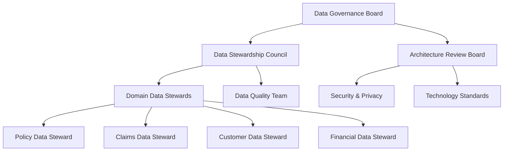
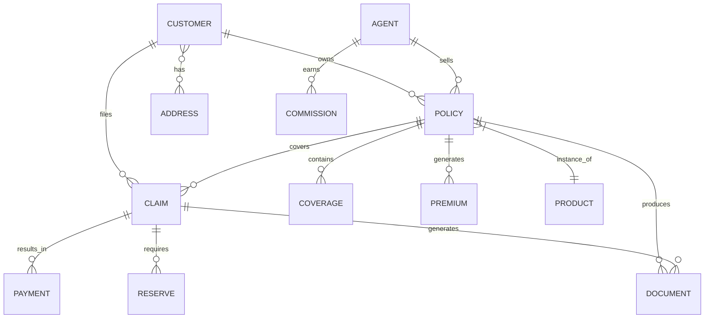
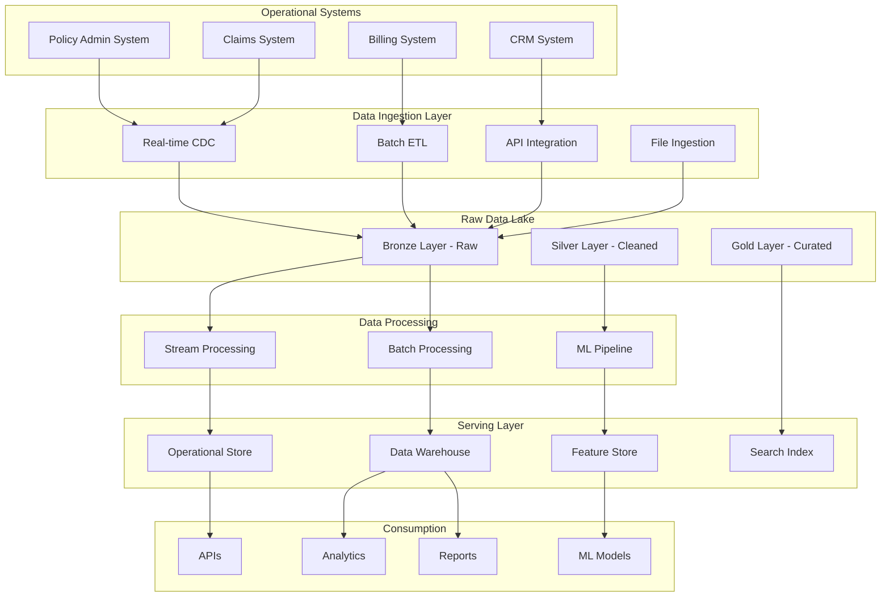
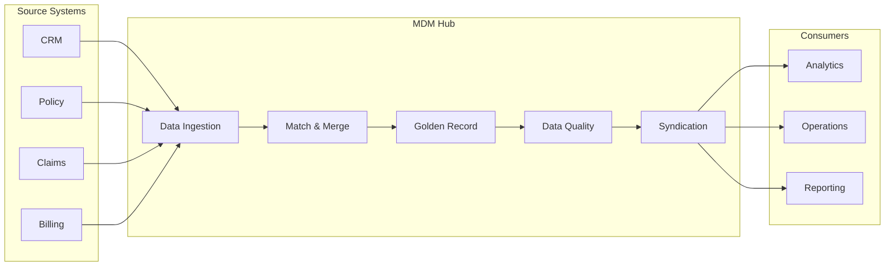
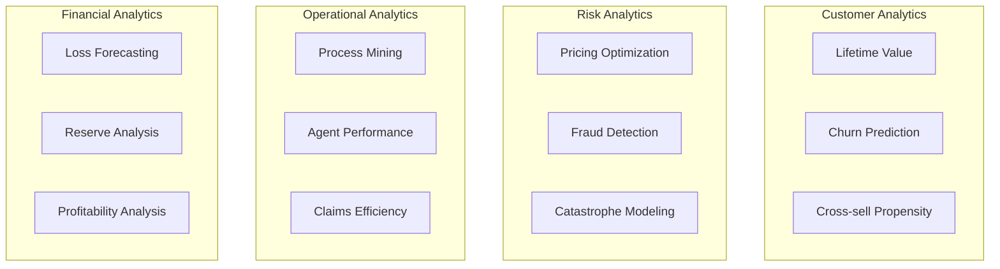

# Data Architecture Document
## P&C Insurance Enterprise Data Platform

### Document Metadata

| Field | Value |
|-------|-------|
| **Architecture Domain** | Data Architecture |
| **Framework** | DAMA-DMBOK + Insurance Standards |
| **Version** | 1.0.0 |
| **Data Strategy** | Hybrid Cloud Data Mesh |
| **Compliance** | GDPR, CCPA, NAIC |

### Executive Summary

This Data Architecture establishes the foundation for a modern, compliant, and intelligent data platform supporting P&C insurance operations. It defines data governance, management principles, and technical architecture enabling real-time analytics, ML/AI capabilities, and regulatory compliance.

### Data Strategy & Vision

#### Strategic Objectives

1. **Single Source of Truth**: Authoritative data for each domain
2. **Real-time Intelligence**: Streaming analytics and insights
3. **Regulatory Excellence**: Built-in compliance and privacy
4. **AI/ML Enablement**: Feature stores and model deployment
5. **Self-Service Analytics**: Democratized data access

### Data Governance Framework

#### Governance Structure



#### RACI Matrix - Data Governance

| Activity | Business | IT | Data Steward | Compliance | Security |
|----------|----------|----|--------------|-----------:|----------|
| Data Classification | C | I | R | A | C |
| Quality Rules | A | C | R | I | I |
| Access Control | I | R | C | C | A |
| Retention Policy | C | I | R | A | C |
| Privacy Impact | I | C | C | R | A |

### Data Domains & Ownership

#### Insurance Data Domains

```yaml
customer_domain:
  owner: Chief Customer Officer
  steward: Customer Data Steward
  entities:
    - customer_master
    - contact_history
    - preferences
    - consents
  classification: Confidential
  
policy_domain:
  owner: Head of Underwriting
  steward: Policy Data Steward
  entities:
    - policies
    - coverages
    - endorsements
    - renewals
  classification: Internal
  
claims_domain:
  owner: Head of Claims
  steward: Claims Data Steward
  entities:
    - claims
    - reserves
    - payments
    - recoveries
  classification: Confidential
  
financial_domain:
  owner: CFO
  steward: Financial Data Steward
  entities:
    - premiums
    - commissions
    - accounting
    - reinsurance
  classification: Highly Confidential
```

### Conceptual Data Model

#### Core Entity Relationships



#### Master Data Entities

```yaml
customer_master:
  attributes:
    core:
      - customer_id (UUID)
      - customer_type (enum)
      - legal_name
      - tax_id (encrypted)
      - inception_date
    pii_vault:
      - ssn (tokenized)
      - date_of_birth (encrypted)
      - drivers_license (encrypted)
    preferences:
      - communication_channel
      - language_preference
      - marketing_consent
  golden_record_rules:
    - source_priority: [CRM, Policy, Claims]
    - match_algorithm: Fuzzy + ML
    - survivorship: Latest trusted source
    
policy_master:
  attributes:
    core:
      - policy_number
      - product_code
      - effective_date
      - expiration_date
      - status
    financial:
      - written_premium
      - earned_premium
      - commission_rate
    risk:
      - territory_code
      - class_code
      - exposure_units
```

### Data Architecture Patterns

#### Hybrid Architecture Model



### Data Platform Technology Stack

#### Technology Components

```yaml
data_storage:
  data_lake:
    technology: AWS S3 / Azure Data Lake
    format: Parquet, Delta Lake
    partitioning: Year/Month/Day/Hour
    
  data_warehouse:
    technology: Snowflake / Redshift
    model: Dimensional (Star Schema)
    refresh: Incremental
    
  operational_store:
    technology: PostgreSQL / DynamoDB
    pattern: CQRS
    
  feature_store:
    technology: Feast / Tecton
    serving: Real-time + Batch
    
data_processing:
  batch:
    technology: Apache Spark / DBT
    orchestration: Airflow / Prefect
    
  streaming:
    technology: Kafka Streams / Flink
    latency: <1 second
    
  ml_platform:
    technology: SageMaker / Databricks
    mlops: MLflow
    
data_integration:
  cdc:
    technology: Debezium / AWS DMS
    
  etl:
    technology: Informatica / Talend
    
  api:
    technology: GraphQL / REST
    
data_governance:
  catalog:
    technology: Collibra / Alation
    
  quality:
    technology: Great Expectations
    
  lineage:
    technology: DataHub / OpenLineage
```

### Data Security & Privacy

#### Security Architecture

```yaml
security_layers:
  network_security:
    - vpc_isolation
    - private_endpoints
    - firewall_rules
    
  access_control:
    - rbac_policies
    - attribute_based_access
    - row_level_security
    - column_masking
    
  encryption:
    at_rest:
      - database: TDE
      - files: AES-256
      - keys: HSM/KMS
    in_transit:
      - protocols: TLS 1.3
      - certificates: mTLS
      
  data_privacy:
    pii_handling:
      - tokenization
      - format_preserving_encryption
      - secure_vault
    anonymization:
      - k_anonymity
      - differential_privacy
    consent_management:
      - purpose_limitation
      - retention_automation
```

#### Privacy Compliance Matrix

| Data Type | GDPR | CCPA | NAIC | Retention | Encryption | Access Control |
|-----------|------|------|------|-----------|------------|----------------|
| PII | Art. 6,7 | Required | Model 668 | 7 years | Required | Need-to-know |
| Sensitive | Art. 9 | Enhanced | State laws | Varies | Required | Restricted |
| Financial | Art. 6 | Standard | SOX | 7 years | Required | Audit trail |
| Behavioral | Consent | Opt-out | N/A | 2 years | Recommended | Purpose-limited |

### Data Quality Management

#### Quality Framework

```yaml
data_quality_dimensions:
  completeness:
    definition: Non-null required fields
    target: >99%
    measurement: Daily
    
  accuracy:
    definition: Matches authoritative source
    target: >98%
    measurement: Weekly
    
  consistency:
    definition: Same across systems
    target: >99%
    measurement: Real-time
    
  timeliness:
    definition: Updated within SLA
    target: >95%
    measurement: Hourly
    
  validity:
    definition: Conforms to business rules
    target: >99%
    measurement: On write
    
  uniqueness:
    definition: No unauthorized duplicates
    target: 100%
    measurement: Daily
```

#### Quality Rules Engine

```python
# Example Data Quality Rules
quality_rules:
  customer:
    - rule: "email_format"
      check: "regex: ^[a-zA-Z0-9._%+-]+@[a-zA-Z0-9.-]+\.[a-zA-Z]{2,}$"
      severity: "warning"
      
    - rule: "age_validity"
      check: "age >= 18 AND age <= 120"
      severity: "error"
      
  policy:
    - rule: "premium_positive"
      check: "premium > 0"
      severity: "error"
      
    - rule: "date_logic"
      check: "effective_date < expiration_date"
      severity: "error"
      
  claims:
    - rule: "loss_date_valid"
      check: "loss_date >= policy_effective AND loss_date <= today()"
      severity: "error"
```

### Master Data Management

#### MDM Architecture



#### MDM Rules

```yaml
matching_rules:
  customer:
    exact_match:
      - ssn
      - tax_id
    fuzzy_match:
      - name: 85% similarity
      - address: 80% similarity
      - phone: exact after normalization
    ml_match:
      - model: customer_similarity_v2
      - threshold: 0.95
      
  hierarchy:
    customer_relationships:
      - individual_to_household
      - subsidiary_to_parent
      - agent_to_agency
```

### Analytics Architecture

#### Analytics Layers

```yaml
analytics_architecture:
  descriptive:
    tools: [Tableau, PowerBI, Looker]
    data_source: Data Warehouse
    refresh: Daily/Hourly
    users: Business analysts
    
  diagnostic:
    tools: [Jupyter, DataBricks]
    data_source: Data Lake
    pattern: Self-service
    users: Data analysts
    
  predictive:
    tools: [SageMaker, DataRobot]
    data_source: Feature Store
    deployment: Model Registry
    users: Data scientists
    
  prescriptive:
    tools: [Custom Apps]
    data_source: Real-time APIs
    latency: <100ms
    users: Business users
```

#### Key Analytics Use Cases



### Data Integration Patterns

#### Integration Approaches

```yaml
integration_patterns:
  synchronous:
    pattern: Request-Reply
    use_cases:
      - Real-time pricing
      - Coverage verification
      - Payment processing
    technology: REST/GraphQL APIs
    
  asynchronous:
    pattern: Publish-Subscribe
    use_cases:
      - Policy updates
      - Claim notifications
      - Customer changes
    technology: Kafka/EventBridge
    
  batch:
    pattern: ETL/ELT
    use_cases:
      - Regulatory reporting
      - Data warehouse refresh
      - Backup synchronization
    technology: Airflow/Informatica
    
  streaming:
    pattern: Event Streaming
    use_cases:
      - Fraud detection
      - Real-time analytics
      - Alert generation
    technology: Kafka Streams/Flink
```

### Metadata Management

#### Metadata Architecture

```yaml
metadata_types:
  business_metadata:
    - definitions
    - ownership
    - criticality
    - compliance_tags
    
  technical_metadata:
    - schemas
    - data_types
    - constraints
    - statistics
    
  operational_metadata:
    - lineage
    - quality_scores
    - usage_metrics
    - performance_stats
    
metadata_repository:
  catalog: Data Catalog Tool
  format: JSON/YAML
  api: GraphQL
  versioning: Git-based
```

### Data Lifecycle Management

#### Lifecycle Policies

```yaml
data_lifecycle:
  hot_tier:
    storage: SSD/Memory
    duration: 0-90 days
    access_pattern: Frequent
    
  warm_tier:
    storage: HDD
    duration: 91-365 days
    access_pattern: Occasional
    
  cold_tier:
    storage: Object Storage
    duration: 1-7 years
    access_pattern: Rare
    
  archive_tier:
    storage: Glacier/Archive
    duration: 7+ years
    access_pattern: Compliance only
    
  deletion:
    trigger: Retention expired
    approval: Required
    audit: Mandatory
```

### Performance & Scalability

#### Performance Targets

| System | Metric | Target | Current | Strategy |
|--------|--------|--------|---------|----------|
| Data Warehouse | Query Response | <5 sec | 3 sec | Materialized views |
| Real-time API | Latency | <100ms | 75ms | Caching layer |
| Batch Processing | Throughput | 1TB/hour | 800GB/hour | Parallel processing |
| Stream Processing | Latency | <1 sec | 500ms | In-memory computing |

### Disaster Recovery

#### Data Recovery Strategy

```yaml
backup_strategy:
  databases:
    method: Continuous replication
    rpo: 15 minutes
    retention: 30 days
    
  data_lake:
    method: Cross-region replication
    rpo: 1 hour
    retention: Indefinite
    
  feature_store:
    method: Snapshot backup
    rpo: 4 hours
    retention: 7 days
    
recovery_testing:
  frequency: Quarterly
  scope: Full recovery
  documentation: Required
  success_criteria: RPO/RTO met
```

---

**Approval Section**

| Role | Name | Signature | Date |
|------|------|-----------|------|
| Chief Data Officer | _______ | _______ | _____ |
| Chief Technology Officer | _______ | _______ | _____ |
| Chief Privacy Officer | _______ | _______ | _____ |

**Document Control**  
- Review Cycle: Quarterly
- Owner: Data Architecture Team
- Distribution: All Data Teams