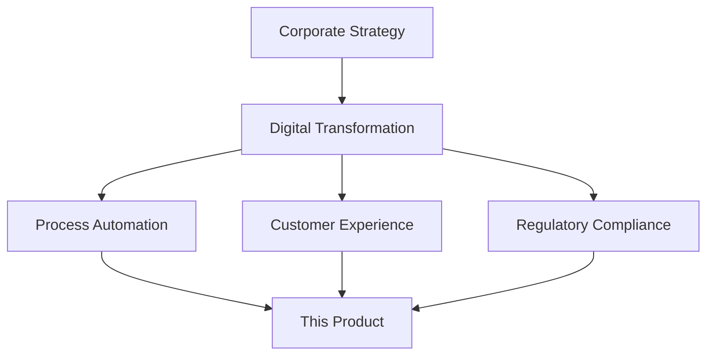
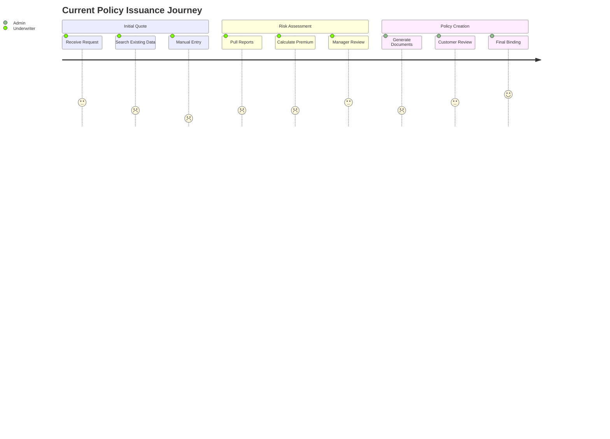
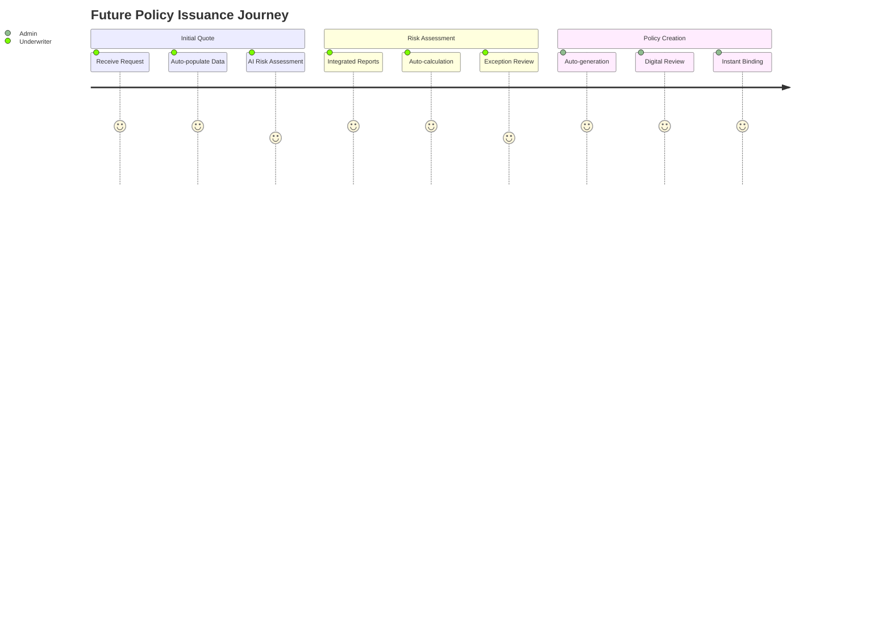
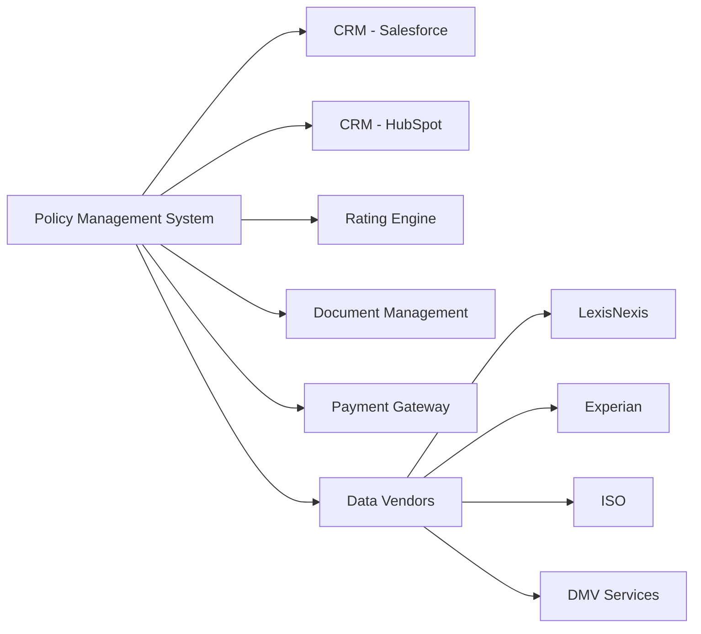

# Data-Driven Product Requirements Document Template
## P&C Insurance Policy Management System

### Document Metadata

| Field | Value |
|-------|-------|
| **Document Type** | Product Requirements Document (PRD) |
| **Template Version** | 2025.1.0 |
| **Compliance Framework** | NAIC/SOC2/TOGAF-ACORD |
| **Document Status** | [Draft/Review/Approved/Deprecated] |
| **Classification** | [Public/Internal/Confidential] |

### Executive Summary

**Product Name**: [System Name]  
**Product Code**: [Internal Reference]  
**Document Version**: [Semantic Version]  
**Product Owner**: [Name] | [Email] | [Phone]  
**Compliance Owner**: [Name] | [Email] | [Phone]  
**Technical Lead**: [Name] | [Email] | [Phone]  
**Business Sponsor**: [Name] | [Title]

**Vision Statement**: 
> [One paragraph describing the transformative impact. Focus on business outcomes, not features. Example: "Transform underwriting efficiency by reducing policy issuance time from days to minutes while maintaining strict compliance and risk controls."]

**Mission Critical Success Factors**:
- [ ] **Business Impact**: [Specific metric, e.g., "Reduce quote-to-bind time by 75%"]
- [ ] **Revenue Target**: [Specific amount/percentage with timeline]
- [ ] **Compliance Achievement**: [Specific certifications/audits to pass]
- [ ] **User Adoption**: [Target percentage and timeline]
- [ ] **Technical Performance**: [Key SLAs to meet]

### Strategic Alignment

#### Business Strategy Linkage


#### OKR Alignment
| Objective | Key Results | Product Contribution |
|-----------|-------------|---------------------|
| [Corp Objective 1] | [KR1.1, KR1.2] | [How this product delivers] |
| [Corp Objective 2] | [KR2.1, KR2.2] | [Specific features/capabilities] |

### Business Context & Justification

#### Market Analysis

**Industry Landscape**:
- **Market Size**: $[X]B (Source: [Industry Report])
- **Growth Rate**: [X]% CAGR 2025-2030
- **Digital Adoption**: [Current state vs. leaders]
- **Regulatory Pressure**: [Key compliance deadlines]

**Competitive Intelligence**:
| Competitor | Solution | Strengths | Weaknesses | Our Differentiation |
|------------|----------|-----------|------------|-------------------|
| [Competitor 1] | [Product] | [List] | [List] | [Unique value] |
| [Competitor 2] | [Product] | [List] | [List] | [Unique value] |

**Market Opportunity**:
- **TAM** (Total Addressable Market): $[Amount]
- **SAM** (Serviceable Addressable Market): $[Amount]
- **SOM** (Serviceable Obtainable Market): $[Amount]
- **Market Share Target**: [X]% by [Year]

#### Business Case

**Financial Model**:
```yaml
revenue_projection:
  year_1: 
    new_business: $[amount]
    retention_improvement: $[amount]
    operational_savings: $[amount]
  year_2:
    new_business: $[amount]
    retention_improvement: $[amount]
    operational_savings: $[amount]
  year_3:
    new_business: $[amount]
    retention_improvement: $[amount]
    operational_savings: $[amount]
    
investment_required:
  development: $[amount]
  infrastructure: $[amount]
  training: $[amount]
  compliance: $[amount]
  
roi_metrics:
  payback_period: [months]
  irr: [percentage]
  npv: $[amount]
```

**Risk-Adjusted Benefits**:
1. **Quantifiable Benefits**:
   - Premium growth: [Calculation method]
   - Cost reduction: [Specific areas and amounts]
   - Loss ratio improvement: [Basis points]

2. **Strategic Benefits**:
   - Market positioning improvement
   - Regulatory compliance assurance
   - Platform for future innovation

### User Research & Personas

#### Research Methodology
- **Interviews Conducted**: [Number] across [roles]
- **Surveys Completed**: [Number] responses
- **Process Observations**: [Hours] of shadowing
- **Data Analysis**: [Datasets examined]

#### Primary Personas

**Persona 1: Senior Underwriter - Sarah**
```yaml
demographics:
  experience: 15+ years
  tech_comfort: Medium
  daily_policies: 20-30

goals:
  - Make accurate risk assessments quickly
  - Maintain compliance without friction
  - Access complete information easily

pain_points:
  - Multiple system logins (average: 7)
  - Manual data re-entry (2hrs/day)
  - Incomplete information delays

success_metrics:
  - Time per policy: <15 minutes
  - First-pass accuracy: >95%
  - System satisfaction: >4.5/5
```

**Persona 2: Policy Administrator - Michael**
```yaml
demographics:
  experience: 5-7 years
  tech_comfort: High
  daily_tasks: 50-70

goals:
  - Process changes efficiently
  - Minimize customer wait time
  - Reduce manual errors

pain_points:
  - Complex endorsement workflows
  - Lack of automation
  - Poor system integration

success_metrics:
  - Task completion time: -60%
  - Error rate: <0.5%
  - Customer satisfaction: >90%
```

#### User Journey Maps

**Current State Journey - Policy Issuance**:


**Future State Journey - Policy Issuance**:


### Functional Requirements

#### Core Capabilities

**Category 1: Policy Lifecycle Management**

| ID | Requirement | Priority | Acceptance Criteria | Compliance Link |
|----|-------------|----------|-------------------|-----------------|
| PLM-001 | System shall support quote generation in <30 seconds | P0 | 95% of quotes generated within SLA | SOC2-Availability |
| PLM-002 | System shall validate coverage limits against state regulations | P0 | 100% compliance with filed rates | NAIC-668 |
| PLM-003 | System shall support multi-line policy bundling | P1 | Support 5 core P&C lines | Business requirement |

**Category 2: Underwriting Automation**

| ID | Requirement | Priority | Acceptance Criteria | Compliance Link |
|----|-------------|----------|-------------------|-----------------|
| UND-001 | System shall integrate with 5 data vendors | P0 | Real-time API response <2s | Performance SLA |
| UND-002 | System shall provide ML-based risk scoring | P1 | Model accuracy >85% | SOC2-Processing |
| UND-003 | System shall flag exceptions for review | P0 | 100% high-risk identification | Risk Management |

#### User Stories

**Epic: Automated Underwriting**

```gherkin
Feature: Automated Risk Assessment
  As an underwriter
  I want the system to automatically gather and analyze risk data
  So that I can make faster, more accurate decisions

  Scenario: Standard Auto Policy Risk Assessment
    Given I have a new auto insurance application
    When I enter the basic customer information
    Then the system should automatically:
      | Action | Expected Result | Time Limit |
      | Retrieve DMV records | Complete driving history | <2 seconds |
      | Pull credit score | Credit-based insurance score | <1 second |
      | Analyze claims history | 5-year claims record | <2 seconds |
      | Calculate risk score | Score with confidence interval | <1 second |
    And present a recommended premium with supporting data
```

### Non-Functional Requirements

#### Performance Requirements

```yaml
response_times:
  api_calls: 
    p50: 200ms
    p95: 500ms
    p99: 1000ms
  page_loads:
    p50: 1s
    p95: 2s
    p99: 3s
  batch_processing:
    throughput: 10000 policies/hour
    
availability:
  uptime_sla: 99.9%
  maintenance_window: Sunday 2-6 AM EST
  rto: 4 hours
  rpo: 1 hour
  
scalability:
  concurrent_users: 1000
  data_growth: 50% YoY
  geographic_distribution: Multi-region active-active
```

#### Security Requirements

**Data Protection Matrix**:
| Data Type | Classification | Encryption | Access Control | Retention |
|-----------|---------------|------------|----------------|-----------|
| PII | Confidential | AES-256 at rest, TLS 1.3 in transit | RBAC + MFA | 7 years |
| Financial | Confidential | AES-256 + tokenization | Need-to-know | 7 years |
| Policy Data | Internal | AES-256 | Role-based | Lifetime + 7 |

**Compliance Requirements**:
- [ ] NAIC Model Law 668 (Data Security)
- [ ] SOC2 Type II Certification
- [ ] State Privacy Laws (CCPA, etc.)
- [ ] PCI DSS (if payment processing)

### Integration Requirements

#### System Integration Map



#### API Specifications

**External Integrations**:
```yaml
salesforce_integration:
  type: REST API
  authentication: OAuth 2.0
  sync_frequency: Real-time
  data_mapping:
    - customer_record
    - policy_summary
    - claims_history
  error_handling: Circuit breaker pattern
  
rating_engine:
  type: gRPC
  authentication: mTLS
  timeout: 5 seconds
  retry_policy: Exponential backoff
  fallback: Cached rates
```

### Success Metrics & KPIs

#### Business Metrics

| Metric | Current Baseline | 6-Month Target | 12-Month Target | Measurement Method |
|--------|-----------------|----------------|-----------------|-------------------|
| Quote-to-Bind Time | 3.5 days | 4 hours | 30 minutes | System analytics |
| First-Pass Accuracy | 72% | 85% | 95% | Quality audits |
| Customer Satisfaction | 3.2/5 | 4.0/5 | 4.5/5 | NPS surveys |
| Cost per Policy | $125 | $75 | $45 | Financial analysis |

#### Technical Metrics

| Metric | Target | Alert Threshold | Page Threshold | Measurement Tool |
|--------|--------|-----------------|----------------|------------------|
| API Uptime | 99.9% | <99.5% | <99% | Datadog |
| Response Time (p99) | <1s | >2s | >5s | APM |
| Error Rate | <0.1% | >0.5% | >1% | Log analytics |
| Security Incidents | 0 | Any | Any | SIEM |

### Implementation Considerations

#### Migration Strategy
1. **Phase 1**: Core policy management (3 months)
2. **Phase 2**: Underwriting automation (2 months)
3. **Phase 3**: Advanced analytics (2 months)
4. **Phase 4**: Full ecosystem integration (2 months)

#### Training Requirements
- **Underwriters**: 16 hours over 2 weeks
- **Administrators**: 8 hours over 1 week
- **IT Support**: 24 hours certification program
- **Management**: 4-hour overview session

#### Change Management
- Executive sponsor communications
- Champion network establishment
- Phased rollout by region/product line
- Success story documentation

### Assumptions & Constraints

#### Assumptions
1. Regulatory approval for automated underwriting by Q2 2025
2. Data vendor APIs remain stable
3. Current infrastructure can support 2x load
4. User adoption follows typical curve

#### Constraints
1. Budget ceiling: $[Amount]
2. Go-live deadline: [Date]
3. Must maintain current operations during transition
4. Regulatory filing requirements per state

### Risks & Mitigation

| Risk | Probability | Impact | Mitigation Strategy | Owner |
|------|-------------|--------|-------------------|--------|
| Regulatory rejection | Medium | High | Early engagement with regulators | Compliance |
| Data vendor changes | Low | High | Multi-vendor strategy | Architecture |
| User adoption resistance | Medium | Medium | Comprehensive training program | Change Mgmt |
| Technical complexity | Medium | Medium | Phased implementation | Tech Lead |

### Approval & Sign-off

| Role | Name | Signature | Date |
|------|------|-----------|------|
| Product Owner | [Name] | ________ | _____ |
| Business Sponsor | [Name] | ________ | _____ |
| Technical Lead | [Name] | ________ | _____ |
| Compliance Officer | [Name] | ________ | _____ |
| CTO | [Name] | ________ | _____ |

---

**Living Document Notice**: This PRD is maintained as living documentation. Updates trigger downstream documentation changes. All modifications must be tracked in version control with clear change descriptions.

**Next Review Date**: [Quarterly cycle]  
**Document Owner**: [Product Owner Name]  
**Template Version**: 2025.1.0