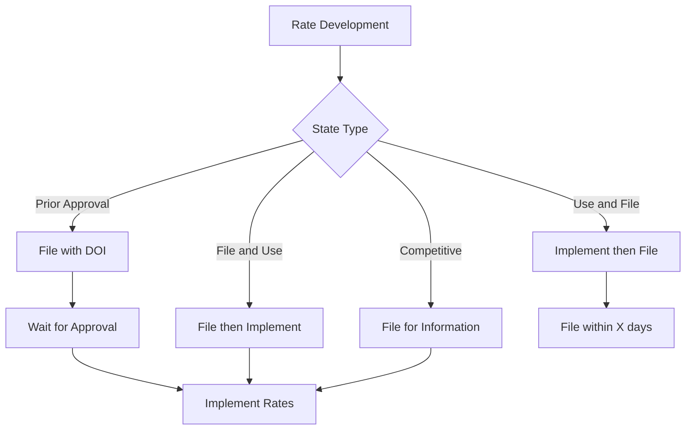

# Insurance-Specific PRD Components
## P&C Carrier Regulatory & Domain Requirements

### Document Metadata

| Field | Value |
|-------|-------|
| **Component Type** | PRD Extension - Insurance Domain |
| **Regulatory Framework** | NAIC/State-specific/SOC2 |
| **Template Version** | 2025.1.0 |
| **Applies To** | All P&C Insurance Products |
| **Compliance Review** | Required Quarterly |

### Regulatory Compliance Matrix

#### Multi-State Compliance Tracker

| State | Lines of Business | Key Regulations | Filing Requirements | Special Considerations |
|-------|------------------|-----------------|---------------------|----------------------|
| CA | Auto, Home, Commercial | Prop 103, CCPA | 60-day prior approval | Rate rollback provisions |
| NY | Auto, Home, Commercial | Reg 187, DFS Cyber | Prior approval | Circular Letter compliance |
| TX | Auto, Home, Commercial | HB 1774, SB 1602 | File and use | Prompt payment requirements |
| FL | Auto, Home, Commercial | SB 76, Hurricane deductibles | Expedited review available | CAT modeling requirements |

#### NAIC Model Law Compliance

**Model Law #668 - Insurance Data Security**
```yaml
compliance_requirements:
  risk_assessment:
    frequency: Annual
    scope: Enterprise-wide
    documentation: Required
    
  information_security_program:
    written_policy: Required
    employee_training: Annual
    incident_response_plan: Required
    vendor_management: Third-party assessments
    
  investigation_requirements:
    breach_determination: 3 business days
    consumer_notification: Without unreasonable delay
    regulator_notification: 72 hours
    
  oversight:
    board_reporting: Annual
    compliance_certification: Annual
```

**Model Law #672 - Insurance Data Security Model Law**
- Licensee compliance requirements
- Third-party service provider oversight
- Incident response planning
- Annual compliance certification

### P&C Product-Specific Requirements

#### Personal Lines Requirements

**Auto Insurance Components**
```yaml
auto_insurance:
  required_coverages:
    bodily_injury_liability:
      minimum_limits: State-specific
      stacking_rules: Defined per state
    property_damage_liability:
      minimum_limits: State-specific
    uninsured_motorist:
      rejection_forms: State-specific requirements
    personal_injury_protection:
      applicable_states: [FL, NY, NJ, PA, etc.]
      
  rating_factors:
    permitted:
      - driving_record
      - credit_score (where allowed)
      - vehicle_characteristics
      - territory
      - age/experience
    prohibited:
      - race
      - religion
      - genetic_information
      
  documentation_requirements:
    - MVR integration
    - CLUE report access
    - Prior insurance verification
    - Garaging address validation
```

**Homeowners Insurance Components**
```yaml
homeowners_insurance:
  coverage_types:
    HO3: Open perils dwelling, named perils contents
    HO5: Open perils comprehensive
    HO6: Condo unit owners
    HO4: Renters/tenants
    
  mandatory_provisions:
    replacement_cost:
      calculation_method: Required documentation
      inflation_guard: Annual adjustment
    ordinance_law:
      coverage_percentage: 10% standard
    liability_coverage:
      minimum: $100,000 typical
      
  catastrophe_considerations:
    hurricane_deductibles:
      trigger: State-specific
      calculation: Percentage vs. flat
    flood_exclusions:
      disclosure: Required
      referral: NFIP information
    earthquake:
      separate_policy: CA requirements
```

#### Commercial Lines Requirements

**Commercial Package Policy (CPP)**
```yaml
commercial_package:
  required_components:
    general_liability:
      occurrence_limits: Per industry standards
      aggregate_limits: Annual reset
    property_coverage:
      valuation_methods: 
        - replacement_cost
        - actual_cash_value
        - agreed_value
    business_interruption:
      waiting_period: Standard 72 hours
      coverage_triggers: Physical damage required
      
  industry_specific:
    marine_systems:
      jones_act_compliance: Required
      pollution_liability: Separate coverage
      navigation_limits: Defined territories
    manufacturing:
      product_liability: Completed operations
      equipment_breakdown: Optional endorsement
    professional_services:
      E&O_coverage: Industry-specific forms
```

### Rating & Underwriting Compliance

#### Rate Filing Requirements



#### Actuarial Requirements
- Loss cost support documentation
- Expense provisions justification
- Profit provision reasonableness
- Credibility standards application
- Territory definitions and support

### Data Privacy & Security Requirements

#### PII Handling Matrix

| Data Element | Classification | Encryption Required | Access Restrictions | Retention Period |
|--------------|---------------|-------------------|-------------------|------------------|
| SSN | Highly Confidential | Yes - At rest & transit | Need-to-know + MFA | 7 years after policy term |
| Driver's License | Confidential | Yes - At rest & transit | Role-based | 7 years after policy term |
| Credit Score | Confidential | Yes - At rest & transit | Underwriting only | 90 days or bind |
| Claims History | Internal | Yes - At rest | Claims & UW | Policy life + 7 years |
| Payment Info | Highly Confidential | PCI DSS compliant | Payment team only | Per PCI requirements |

#### Consent Management

```yaml
consent_requirements:
  credit_check:
    disclosure: FCRA compliant notice
    opt_in: Required before pull
    adverse_action: Required if declined
    
  information_sharing:
    affiliates: Opt-out notice required
    third_parties: Opt-in required
    marketing: CAN-SPAM compliance
    
  data_usage:
    purpose_limitation: Stated purposes only
    retention_limits: Defined by type
    access_rights: Consumer portal required
```

### Claims Handling Requirements

#### First Notice of Loss (FNOL)
```yaml
fnol_requirements:
  capture_elements:
    mandatory:
      - date_of_loss
      - loss_location
      - loss_description
      - injured_parties
      - police_report_number
      - contact_information
    optional:
      - photos
      - witness_information
      - other_insurance
      
  response_sla:
    acknowledgment: 24 hours
    adjuster_assignment: 48 hours
    initial_contact: 72 hours
    
  regulatory_notices:
    fraud_warning: State-specific language
    coverage_explanation: Required
    appeal_rights: Must be provided
```

#### Fair Claims Practices Compliance
- Prompt investigation requirements
- Good faith claim handling
- Documented claim decisions
- Timely payment provisions
- Proper denial procedures

### Bureau & Statistical Reporting

#### ISO Reporting Requirements
```yaml
iso_reporting:
  statistical_plans:
    personal_auto: Monthly submission
    homeowners: Quarterly submission
    commercial: Policy-level detail
    
  data_elements:
    required:
      - policy_effective_date
      - coverage_limits
      - premium_by_coverage
      - territory_code
      - class_code
      - loss_history
      
  quality_standards:
    error_rate: <2%
    timeliness: Within 60 days
    completeness: 100% required fields
```

#### State-Specific Reporting
- California CDI statistical reports
- Texas TDI call volume reports
- Florida OIR data calls
- New York DFS examinations

### Product Development Compliance

#### Form Filing Requirements

**Personal Lines Forms**
- State-specific amendatory endorsements
- Mandatory coverage offers documentation
- Rejection forms and waivers
- Plain language requirements

**Commercial Lines Forms**
- Industry-specific endorsements
- Manuscript policy provisions
- Large deductible agreements
- Self-insured retention documentation

### System Audit Requirements

#### SOC2 Control Mapping
```yaml
soc2_controls:
  CC1_Control_Environment:
    - Management philosophy documentation
    - Organizational structure clarity
    - HR policies and procedures
    
  CC2_Information_Communication:
    - Internal communication protocols
    - External communication standards
    - Reporting mechanisms
    
  CC3_Risk_Assessment:
    - Annual risk assessment
    - Fraud risk evaluation
    - Vendor risk management
    
  CC4_Monitoring:
    - Continuous monitoring tools
    - Performance metrics tracking
    - Remediation procedures
    
  CC5_Control_Activities:
    - IT general controls
    - Application controls
    - Physical security measures
```

### Regulatory Examination Readiness

#### Documentation Requirements
1. **Policy Administration**
   - Complete policy files
   - Underwriting documentation
   - Rate calculation support
   - Endorsement history

2. **Claims Files**
   - Complete claim documentation
   - Reserve adequacy support
   - Payment authorization
   - Denial letters and appeals

3. **Compliance Records**
   - Training completion records
   - Complaint handling logs
   - Regulatory correspondence
   - Internal audit reports

### Multi-State Operational Considerations

#### Licensing Requirements
- Producer licensing tracking
- Adjuster licensing management
- Surplus lines compliance
- Non-admitted coverage tracking

#### Tax Compliance
- Premium tax calculations
- Municipal tax requirements
- Surplus lines tax filing
- Fire marshal tax remittance

### Innovation & Regulatory Sandbox Participation

#### InsurTech Compliance Paths
```yaml
regulatory_innovation:
  sandbox_programs:
    participating_states: [AZ, KY, UT, WV, etc.]
    application_requirements:
      - Innovation description
      - Consumer benefit analysis
      - Risk mitigation plan
      - Exit strategy
      
  pilot_program_structure:
    duration: Typically 2 years
    customer_limits: State-specific
    reporting: Quarterly to regulator
    consumer_protection: Maintained
```

### Disaster Response Requirements

#### Catastrophe Response Plan
- Emergency adjuster deployment
- Moratorium compliance tracking
- Fast-track claim procedures
- Regulatory reporting escalation
- Consumer communication templates

### Environmental & Social Governance (ESG)

#### Climate Risk Disclosure
- TCFD alignment requirements
- Physical risk assessment
- Transition risk evaluation
- Scenario analysis documentation

#### Diversity & Inclusion Reporting
- Supplier diversity tracking
- Board diversity metrics
- Community investment reporting
- Fair lending compliance

---

**Compliance Note**: This component must be reviewed by Legal and Compliance teams before any PRD approval. All regulatory requirements are subject to change and must be verified against current law.

**Review Cycle**: Quarterly or upon regulatory change  
**Document Owner**: Compliance Officer  
**Last Regulatory Update**: [Date]  
**Next Scheduled Review**: [Date]