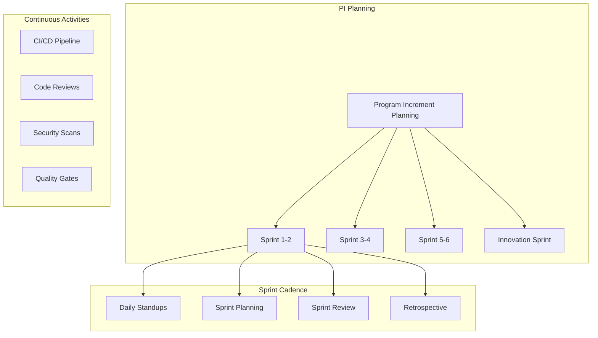
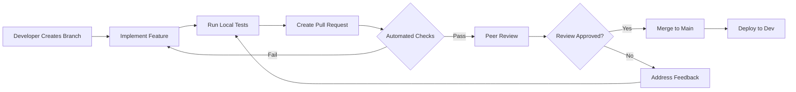
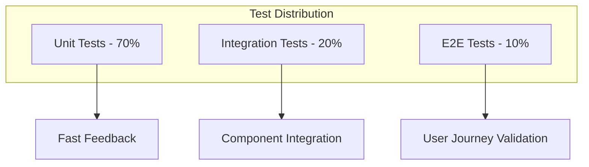
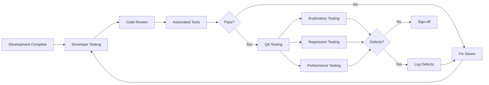

# Development and Configuration Phase
## Implementation Plan - Phase 2

### Document Metadata

| Field | Value |
|-------|-------|
| **Phase** | 2 of 4 |
| **Duration** | 16-20 Weeks |
| **Methodology** | Scaled Agile (SAFe) |
| **Version** | 1.0.0 |
| **Prerequisites** | Phase 1 Complete |

### Phase Overview

The Development and Configuration phase transforms approved designs into working software through iterative development, continuous integration, and progressive elaboration while maintaining quality and architectural integrity.

### Development Methodology

#### Agile Framework



**Sprint Structure**

```yaml
sprint_configuration:
  duration: 2 weeks
  ceremonies:
    planning:
      duration: 4 hours
      participants: [Team, PO, SM]
      outputs: [Sprint backlog, Sprint goal]
      
    daily_standup:
      duration: 15 minutes
      time: 9:00 AM
      format: [Yesterday, Today, Blockers]
      
    review:
      duration: 2 hours
      participants: [Team, PO, Stakeholders]
      outputs: [Demo, Feedback, Acceptance]
      
    retrospective:
      duration: 1.5 hours
      participants: [Team, SM]
      outputs: [Improvements, Action items]
      
  team_structure:
    size: 7-9 members
    roles:
      - product_owner: 1
      - scrum_master: 1
      - developers: 4-5
      - qa_engineers: 1-2
      - ux_designer: 1
```

### Development Standards

#### Coding Standards

```yaml
coding_standards:
  java:
    style_guide: Google Java Style Guide
    static_analysis:
      - tool: SonarQube
      - quality_gate: No critical issues
      - coverage: >80%
      - complexity: <10 per method
    naming_conventions:
      - classes: PascalCase
      - methods: camelCase
      - constants: UPPER_SNAKE_CASE
      - packages: lowercase
      
  python:
    style_guide: PEP 8
    tools:
      - formatter: Black
      - linter: Pylint
      - type_checker: mypy
    docstring: Google style
    
  javascript/typescript:
    style_guide: Airbnb
    tools:
      - linter: ESLint
      - formatter: Prettier
    framework_specific:
      - react: Hooks preferred
      - testing: Jest + RTL
      
  sql:
    style_guide: SQL Style Guide
    naming:
      - tables: snake_case
      - columns: snake_case
      - indexes: idx_table_columns
```

#### Code Review Process



**Review Checklist**

```yaml
code_review_checklist:
  functionality:
    - [ ] Feature works as specified
    - [ ] Edge cases handled
    - [ ] Error handling implemented
    - [ ] No regression issues
    
  code_quality:
    - [ ] Follows coding standards
    - [ ] DRY principle applied
    - [ ] SOLID principles followed
    - [ ] Clear naming conventions
    
  testing:
    - [ ] Unit tests written
    - [ ] Integration tests added
    - [ ] Test coverage >80%
    - [ ] Tests are meaningful
    
  security:
    - [ ] No hardcoded secrets
    - [ ] Input validation present
    - [ ] SQL injection prevented
    - [ ] XSS protection implemented
    
  performance:
    - [ ] No N+1 queries
    - [ ] Efficient algorithms used
    - [ ] Caching implemented where needed
    - [ ] Database queries optimized
    
  documentation:
    - [ ] Code comments added
    - [ ] API documentation updated
    - [ ] README updated if needed
    - [ ] Architecture diagrams current
```

### Service Development

#### Microservice Template

```yaml
microservice_structure:
  project_layout:
    ├── src/
    │   ├── main/
    │   │   ├── java/com/insurance/service/
    │   │   │   ├── controller/
    │   │   │   ├── service/
    │   │   │   ├── repository/
    │   │   │   ├── model/
    │   │   │   ├── dto/
    │   │   │   ├── mapper/
    │   │   │   ├── exception/
    │   │   │   ├── config/
    │   │   │   └── Application.java
    │   │   └── resources/
    │   │       ├── application.yml
    │   │       ├── application-dev.yml
    │   │       ├── application-prod.yml
    │   │       └── logback.xml
    │   └── test/
    ├── docker/
    │   └── Dockerfile
    ├── k8s/
    │   ├── deployment.yaml
    │   ├── service.yaml
    │   └── configmap.yaml
    ├── docs/
    │   ├── api/
    │   └── architecture/
    ├── scripts/
    ├── pom.xml
    └── README.md
    
  standard_components:
    - health_checks: /actuator/health
    - metrics: /actuator/metrics
    - api_docs: /swagger-ui.html
    - circuit_breaker: Resilience4j
    - service_discovery: Eureka/Consul
    - config_management: Spring Cloud Config
    - tracing: OpenTelemetry
```

#### API Development Standards

```yaml
api_standards:
  rest_conventions:
    versioning:
      pattern: /api/v{version}/{resource}
      example: /api/v1/policies
      
    http_methods:
      GET: Read operations
      POST: Create operations
      PUT: Full update
      PATCH: Partial update
      DELETE: Delete operations
      
    status_codes:
      200: Success
      201: Created
      204: No Content
      400: Bad Request
      401: Unauthorized
      403: Forbidden
      404: Not Found
      409: Conflict
      500: Internal Error
      
    response_format:
      success:
        data: object/array
        metadata:
          timestamp: ISO-8601
          version: string
          
      error:
        error:
          code: string
          message: string
          details: array
          timestamp: ISO-8601
          
  api_documentation:
    specification: OpenAPI 3.1
    requirements:
      - [ ] All endpoints documented
      - [ ] Request/response examples
      - [ ] Error responses documented
      - [ ] Authentication described
      - [ ] Rate limits specified
```

### Database Development

#### Database Standards

```yaml
database_development:
  schema_design:
    naming_conventions:
      tables: snake_case, plural
      columns: snake_case
      primary_keys: id
      foreign_keys: {table}_id
      indexes: idx_{table}_{columns}
      constraints: {type}_{table}_{columns}
      
  required_columns:
    - id: UUID/BIGSERIAL
    - created_at: TIMESTAMP
    - created_by: VARCHAR
    - updated_at: TIMESTAMP
    - updated_by: VARCHAR
    - version: INTEGER (optimistic locking)
    
  migration_strategy:
    tool: Flyway/Liquibase
    naming: V{version}__{description}.sql
    location: src/main/resources/db/migration
    rollback: Required for each migration
    
  performance_guidelines:
    - Create indexes for foreign keys
    - Use partial indexes where applicable
    - Implement table partitioning for large tables
    - Regular VACUUM and ANALYZE
    - Monitor slow queries
```

#### Data Access Patterns

```java
// Repository Pattern Example
@Repository
public interface PolicyRepository extends JpaRepository<Policy, UUID> {
    
    @Query("SELECT p FROM Policy p WHERE p.customerId = :customerId")
    List<Policy> findByCustomerId(@Param("customerId") UUID customerId);
    
    @Modifying
    @Query("UPDATE Policy p SET p.status = :status WHERE p.id = :id")
    int updateStatus(@Param("id") UUID id, @Param("status") PolicyStatus status);
    
    @EntityGraph(attributePaths = {"coverages", "endorsements"})
    Optional<Policy> findWithDetailsById(UUID id);
}

// Service Layer Example
@Service
@Transactional
public class PolicyService {
    
    @Cacheable(value = "policies", key = "#id")
    public PolicyDTO getPolicy(UUID id) {
        return policyRepository.findById(id)
            .map(policyMapper::toDTO)
            .orElseThrow(() -> new PolicyNotFoundException(id));
    }
    
    @CacheEvict(value = "policies", key = "#result.id")
    public PolicyDTO createPolicy(CreatePolicyRequest request) {
        // Business logic implementation
    }
}
```

### Frontend Development

#### Component Architecture

```typescript
// React Component Structure
interface PolicyDetailsProps {
  policyId: string;
  onUpdate: (policy: Policy) => void;
}

const PolicyDetails: React.FC<PolicyDetailsProps> = ({ policyId, onUpdate }) => {
  const { data: policy, isLoading, error } = usePolicy(policyId);
  const [isEditing, setIsEditing] = useState(false);
  
  if (isLoading) return <LoadingSpinner />;
  if (error) return <ErrorDisplay error={error} />;
  
  return (
    <Card>
      <CardHeader>
        <Title>Policy #{policy.number}</Title>
        <Actions>
          <Button onClick={() => setIsEditing(true)}>Edit</Button>
        </Actions>
      </CardHeader>
      <CardBody>
        {isEditing ? (
          <PolicyEditForm policy={policy} onSave={handleSave} />
        ) : (
          <PolicyDisplay policy={policy} />
        )}
      </CardBody>
    </Card>
  );
};
```

#### State Management

```typescript
// Redux Toolkit Slice Example
const policySlice = createSlice({
  name: 'policy',
  initialState: {
    policies: [],
    selectedPolicy: null,
    loading: false,
    error: null
  },
  reducers: {
    // Synchronous actions
    selectPolicy: (state, action) => {
      state.selectedPolicy = action.payload;
    }
  },
  extraReducers: (builder) => {
    // Async actions
    builder
      .addCase(fetchPolicies.pending, (state) => {
        state.loading = true;
      })
      .addCase(fetchPolicies.fulfilled, (state, action) => {
        state.loading = false;
        state.policies = action.payload;
      })
      .addCase(fetchPolicies.rejected, (state, action) => {
        state.loading = false;
        state.error = action.error.message;
      });
  }
});
```

### Integration Development

#### Integration Patterns

```yaml
integration_patterns:
  synchronous:
    rest_client:
      library: Feign/RestTemplate
      timeout: 30 seconds
      retry: 3 attempts
      circuit_breaker: enabled
      
    example_implementation:
      ```java
      @FeignClient(name = "rating-service")
      public interface RatingServiceClient {
          @PostMapping("/api/v1/rates/calculate")
          RateResponse calculateRate(@RequestBody RateRequest request);
      }
      ```
      
  asynchronous:
    message_broker: Kafka
    patterns:
      - publish_subscribe
      - request_reply
      - event_sourcing
      
    example_implementation:
      ```java
      @Component
      public class PolicyEventPublisher {
          @Autowired
          private KafkaTemplate<String, PolicyEvent> kafkaTemplate;
          
          public void publishPolicyCreated(Policy policy) {
              PolicyEvent event = PolicyEvent.builder()
                  .eventType(EventType.POLICY_CREATED)
                  .policyId(policy.getId())
                  .timestamp(Instant.now())
                  .build();
                  
              kafkaTemplate.send("policy-events", event);
          }
      }
      ```
```

### Testing Strategy

#### Test Pyramid



#### Testing Standards

```yaml
testing_standards:
  unit_testing:
    framework:
      java: JUnit 5 + Mockito
      javascript: Jest
      python: pytest
    coverage_target: >80%
    naming: should_ExpectedBehavior_When_StateUnderTest
    
  integration_testing:
    framework: TestContainers
    scope:
      - Database integration
      - External API calls
      - Message broker integration
    isolation: Separate test database
    
  contract_testing:
    framework: Pact
    providers:
      - External APIs
      - Internal services
    consumers:
      - Frontend applications
      - Mobile apps
      
  e2e_testing:
    framework: Cypress/Playwright
    scope:
      - Critical user journeys
      - Cross-browser testing
    environment: Dedicated E2E environment
```

### Quality Assurance

#### QA Process



#### Defect Management

```yaml
defect_lifecycle:
  severity_levels:
    critical:
      description: System crash, data loss
      sla: Fix within 4 hours
      
    high:
      description: Major feature broken
      sla: Fix within 1 day
      
    medium:
      description: Feature partially working
      sla: Fix within 1 sprint
      
    low:
      description: Cosmetic issues
      sla: Fix in next release
      
  defect_tracking:
    tool: JIRA
    required_fields:
      - summary
      - description
      - steps_to_reproduce
      - expected_result
      - actual_result
      - severity
      - priority
      - environment
      - attachments
```

### Configuration Management

#### Environment Configuration

```yaml
environment_configuration:
  development:
    database:
      host: dev-db.internal
      pool_size: 10
    services:
      urls: dev-*.internal
    features:
      debug_mode: true
      
  staging:
    database:
      host: staging-db.internal
      pool_size: 20
    services:
      urls: staging-*.internal
    features:
      debug_mode: false
      
  production:
    database:
      host: prod-db.internal
      pool_size: 50
    services:
      urls: prod-*.internal
    features:
      debug_mode: false
      
  secrets_management:
    tool: HashiCorp Vault
    rotation: Quarterly
    access: Role-based
```

### Performance Engineering

#### Performance Standards

```yaml
performance_requirements:
  response_times:
    api_calls:
      p50: <200ms
      p95: <500ms
      p99: <1000ms
      
    page_loads:
      p50: <2s
      p95: <3s
      p99: <5s
      
  throughput:
    quotes: 1000/second
    policies: 500/second
    claims: 200/second
    
  resource_utilization:
    cpu: <70%
    memory: <80%
    database_connections: <80%
    
  testing_approach:
    tools:
      - k6
      - JMeter
      - Gatling
    scenarios:
      - Load testing
      - Stress testing
      - Spike testing
      - Soak testing
```

### Documentation Standards

#### Technical Documentation

```yaml
documentation_requirements:
  code_documentation:
    - [ ] All public APIs documented
    - [ ] Complex algorithms explained
    - [ ] Design decisions captured
    - [ ] Examples provided
    
  api_documentation:
    - [ ] OpenAPI specification
    - [ ] Authentication guide
    - [ ] Rate limiting explained
    - [ ] Error handling documented
    
  architecture_documentation:
    - [ ] Component diagrams
    - [ ] Sequence diagrams
    - [ ] Deployment diagrams
    - [ ] Data flow diagrams
    
  operational_documentation:
    - [ ] Runbooks created
    - [ ] Troubleshooting guides
    - [ ] Monitoring setup
    - [ ] Disaster recovery procedures
```

### Security Implementation

#### Security Controls

```yaml
security_implementation:
  authentication:
    method: OAuth 2.0 + JWT
    token_expiry: 1 hour
    refresh_token: 7 days
    mfa: Required for sensitive operations
    
  authorization:
    model: RBAC + ABAC
    implementation: Spring Security / OPA
    audit: All access logged
    
  data_protection:
    encryption_at_rest: AES-256
    encryption_in_transit: TLS 1.3
    pii_handling: Tokenization
    key_management: HSM/KMS
    
  application_security:
    - [ ] Input validation
    - [ ] Output encoding
    - [ ] SQL injection prevention
    - [ ] XSS protection
    - [ ] CSRF tokens
    - [ ] Security headers
```

### DevOps Integration

#### CI/CD Pipeline

```yaml
pipeline_stages:
  build:
    - checkout_code
    - restore_dependencies
    - compile
    - unit_tests
    - static_analysis
    
  quality_gates:
    - code_coverage: >80%
    - sonar_issues: 0 critical
    - security_scan: pass
    
  package:
    - build_artifacts
    - build_docker_image
    - push_to_registry
    
  deploy_dev:
    - update_configs
    - deploy_to_k8s
    - run_smoke_tests
    
  integration_tests:
    - deploy_test_env
    - run_integration_suite
    - performance_tests
    
  promote_staging:
    - manual_approval
    - deploy_staging
    - run_e2e_tests
```

### Progress Tracking

#### Sprint Metrics

```yaml
sprint_metrics:
  velocity:
    planned: 80 points
    completed: 75 points
    trend: increasing
    
  quality:
    defect_density: 0.5/KLOC
    test_coverage: 85%
    code_review_coverage: 100%
    
  burndown:
    ideal_rate: linear
    actual_rate: tracked_daily
    impediments: logged
    
  team_health:
    satisfaction: 4.2/5
    collaboration: High
    knowledge_sharing: Regular
```

### Risk Management

#### Development Risks

| Risk | Impact | Mitigation | Status |
|------|--------|------------|--------|
| Technical debt accumulation | High | Regular refactoring sprints | Active |
| Integration complexity | Medium | Early integration testing | Monitoring |
| Performance degradation | High | Continuous performance testing | Active |
| Security vulnerabilities | High | Regular security scans | Active |

### Phase Completion Criteria

```yaml
exit_criteria:
  code_complete:
    - [ ] All user stories implemented
    - [ ] Code review completed
    - [ ] Unit tests passing
    - [ ] Integration tests passing
    
  quality_assured:
    - [ ] QA sign-off obtained
    - [ ] Performance benchmarks met
    - [ ] Security scan passed
    - [ ] Documentation complete
    
  ready_for_deployment:
    - [ ] Deployment scripts tested
    - [ ] Rollback procedures verified
    - [ ] Monitoring configured
    - [ ] Runbooks prepared
```

---

**Sign-off Section**

| Role | Name | Signature | Date |
|------|------|-----------|------|
| Development Lead | _______ | _______ | _____ |
| QA Lead | _______ | _______ | _____ |
| Product Owner | _______ | _______ | _____ |

**Document Control**  
- Phase Status: [Not Started/In Progress/Complete]
- Last Updated: [Date]
- Next Review: [Sprint End]