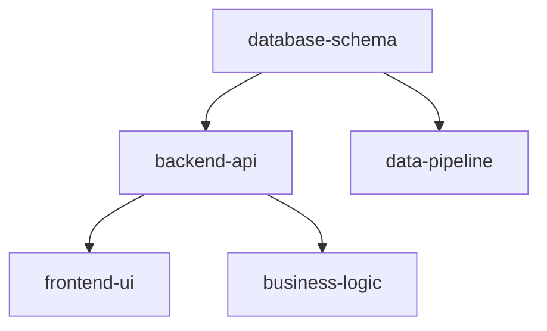

# Wave Execution Context Template

## Wave Information
- **Wave Number**: [1|2|3]
- **Wave Focus**: [Foundation|Features|Polish]
- **Start Time**: [ISO-8601 timestamp]
- **Target Duration**: [2 hours|1 hour|30 minutes]
- **Parallelization Level**: [Maximum|Moderate|Minimal]

## Pre-Wave Context Synthesis

### Project Understanding
*Summary of project requirements from source_documents/*

### Technical Stack
*Key technologies and frameworks being used*

### Domain Specifics
*Domain-specific requirements and constraints*

## Agent Deployment Plan

### Development Agents
| Agent ID | Type | Assigned Tasks | Dependencies | Branch Name |
|----------|------|----------------|--------------|-------------|
| [agent-001] | [type] | [tasks] | [deps] | [branch] |

### Support Agents
| Agent ID | Role | Responsibilities | Always Active |
|----------|------|------------------|---------------|
| communication-historian | Coordinator | Message relay, conflict detection | Yes |

## Dependency Graph

## Success Criteria
- [ ] All planned components created
- [ ] Tests passing
- [ ] No integration conflicts
- [ ] Documentation updated
- [ ] PRs created and reviewed

## Risk Mitigation
| Risk | Mitigation Strategy |
|------|-------------------|
| [Identified risk] | [How to handle] |

## Post-Wave Checklist
- [ ] All agents reported completion
- [ ] Branches pushed to remote
- [ ] PRs created
- [ ] Conflicts resolved
- [ ] Integration tested
- [ ] Patterns learned documented
- [ ] Next wave prepared